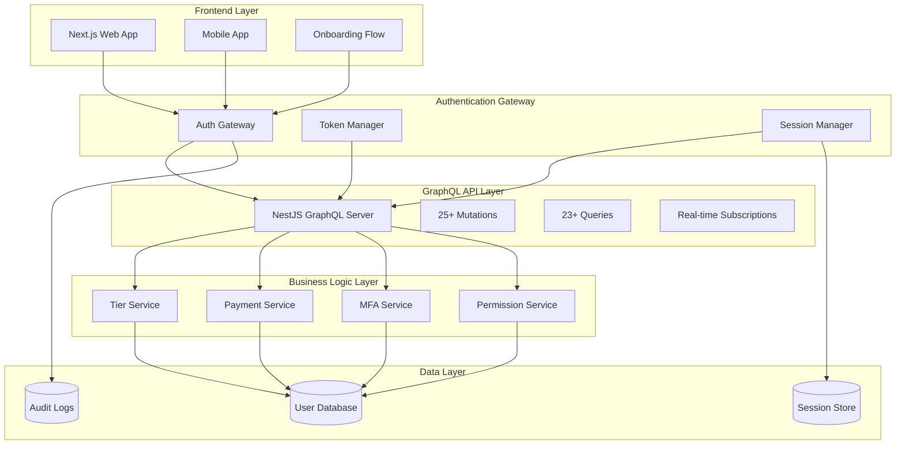
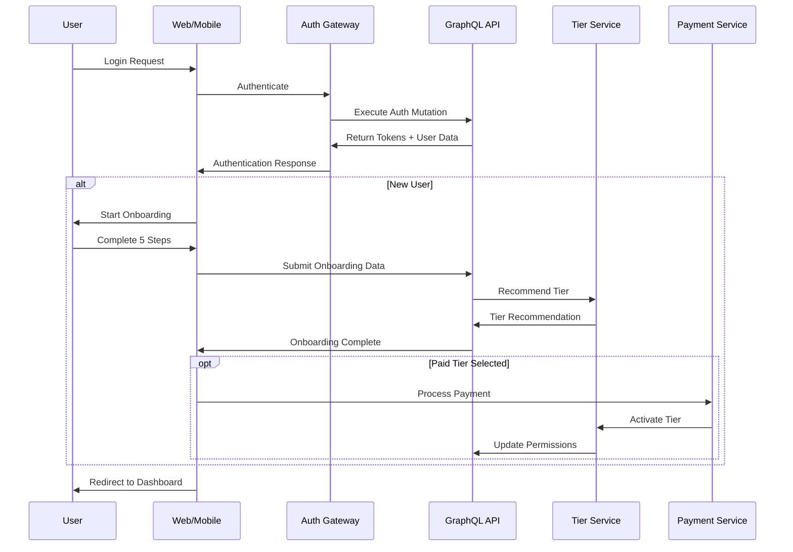

# Design Document: Complete Authentication Integration

## Overview

This design outlines the architecture and implementation approach for achieving 100% authentication module integration in a Business Management Project. The system will bridge the gap between a sophisticated NestJS GraphQL backend (with 25+ mutations, 23+ queries) and frontend applications (Next.js web and mobile), ensuring complete utilization of all authentication capabilities.

The design focuses on five key integration areas:
1. **Onboarding Flow Integration** - Complete backend integration for the 5-step user onboarding
2. **Tier-Based Access Control** - Full implementation of 4-tier subscription system
3. **Mobile Authentication Parity** - Complete feature equivalence across platforms
4. **Payment Integration** - Seamless subscription management and tier upgrades
5. **Real-Time Security Features** - Live authentication events and monitoring

## Architecture

### High-Level Architecture



### Authentication Flow Architecture



## Components and Interfaces

### 1. Authentication Gateway

**Purpose**: Central authentication orchestrator that manages all auth operations across platforms.

**Key Responsibilities**:
- Token validation and refresh management
- Cross-platform session synchronization
- Security event broadcasting
- Device fingerprinting and tracking

**Interface**:
```typescript
interface AuthGateway {
  authenticate(credentials: AuthCredentials): Promise<AuthResult>
  refreshToken(refreshToken: string): Promise<TokenPair>
  validateSession(sessionId: string): Promise<SessionInfo>
  broadcastSecurityEvent(event: SecurityEvent): void
  trackDevice(deviceInfo: DeviceInfo): Promise<DeviceSession>
}

interface AuthResult {
  tokens: TokenPair
  user: UserProfile
  permissions: Permission[]
  tier: TierInfo
  requiresOnboarding: boolean
}
```

### 2. Onboarding Integration Service

**Purpose**: Manages the complete 5-step onboarding process with backend persistence.

**Key Responsibilities**:
- Step-by-step progress tracking
- Business needs assessment
- Tier recommendation engine
- Onboarding data persistence via GraphQL

**Interface**:
```typescript
interface OnboardingService {
  startOnboarding(userId: string): Promise<OnboardingSession>
  submitStep(sessionId: string, step: number, data: StepData): Promise<StepResult>
  calculateTierRecommendation(businessData: BusinessProfile): Promise<TierRecommendation>
  completeOnboarding(sessionId: string, selectedTier: TierType): Promise<OnboardingResult>
  resumeOnboarding(userId: string): Promise<OnboardingSession>
}

interface OnboardingSession {
  sessionId: string
  userId: string
  currentStep: number
  completedSteps: StepData[]
  recommendedTier: TierType
  expiresAt: Date
}
```

### 3. Tier Management System

**Purpose**: Implements complete 4-tier access control with real-time permission updates.

**Key Responsibilities**:
- Tier-based permission enforcement
- Real-time access control updates
- Feature availability management
- Upgrade/downgrade workflows

**Interface**:
```typescript
interface TierManager {
  validateAccess(userId: string, feature: string): Promise<AccessResult>
  upgradeTier(userId: string, newTier: TierType): Promise<TierUpgradeResult>
  downgradeTier(userId: string, reason: DowngradeReason): Promise<TierDowngradeResult>
  getTierFeatures(tier: TierType): Promise<FeatureSet>
  broadcastTierChange(userId: string, oldTier: TierType, newTier: TierType): void
}

enum TierType {
  MICRO = 'micro',
  SMALL = 'small',
  MEDIUM = 'medium',
  ENTERPRISE = 'enterprise'
}

interface FeatureSet {
  tier: TierType
  features: string[]
  limits: Record<string, number>
  permissions: Permission[]
}
```

### 4. Mobile Authentication Bridge

**Purpose**: Provides complete authentication parity between web and mobile platforms.

**Key Responsibilities**:
- OAuth provider integration for mobile
- Biometric authentication support
- Mobile-specific session management
- Push notification integration for security events

**Interface**:
```typescript
interface MobileAuthBridge {
  authenticateWithBiometrics(userId: string): Promise<BiometricAuthResult>
  handleOAuthCallback(provider: OAuthProvider, code: string): Promise<AuthResult>
  registerPushToken(userId: string, token: string): Promise<void>
  syncSessionAcrossDevices(userId: string): Promise<DeviceSession[]>
  handleDeepLink(url: string): Promise<DeepLinkResult>
}

interface BiometricAuthResult {
  success: boolean
  authMethod: 'fingerprint' | 'face' | 'voice'
  fallbackToPassword: boolean
}
```

### 5. Payment Integration Service

**Purpose**: Manages subscription payments and tier activation workflows.

**Key Responsibilities**:
- Payment processing for tier upgrades
- Subscription lifecycle management
- Failed payment handling
- Billing integration with tier system

**Interface**:
```typescript
interface PaymentService {
  processSubscription(userId: string, tier: TierType, paymentMethod: PaymentMethod): Promise<PaymentResult>
  handleWebhook(event: PaymentWebhookEvent): Promise<void>
  cancelSubscription(userId: string): Promise<CancellationResult>
  updatePaymentMethod(userId: string, paymentMethod: PaymentMethod): Promise<UpdateResult>
  getSubscriptionStatus(userId: string): Promise<SubscriptionStatus>
}

interface PaymentResult {
  success: boolean
  subscriptionId: string
  nextBillingDate: Date
  tierActivated: boolean
}
```

### 6. Real-Time Event System

**Purpose**: Provides live authentication events and security monitoring across all platforms.

**Key Responsibilities**:
- WebSocket connection management
- Security event broadcasting
- Real-time permission updates
- Cross-device notification delivery

**Interface**:
```typescript
interface RealTimeEventSystem {
  subscribe(userId: string, eventTypes: EventType[]): Promise<Subscription>
  broadcast(event: SecurityEvent): Promise<void>
  notifyPermissionChange(userId: string, permissions: Permission[]): Promise<void>
  alertSecurityThreat(userId: string, threat: SecurityThreat): Promise<void>
}

enum EventType {
  LOGIN = 'login',
  LOGOUT = 'logout',
  MFA_CHALLENGE = 'mfa_challenge',
  PERMISSION_CHANGE = 'permission_change',
  TIER_CHANGE = 'tier_change',
  SECURITY_ALERT = 'security_alert',
  NEW_DEVICE = 'new_device',
  SESSION_EXPIRED = 'session_expired'
}
```

## Data Models

### User Profile Model
```typescript
interface UserProfile {
  id: string
  email: string
  username: string
  tier: TierType
  permissions: Permission[]
  mfaEnabled: boolean
  onboardingCompleted: boolean
  createdAt: Date
  lastLoginAt: Date
  securitySettings: SecuritySettings
}

interface SecuritySettings {
  ipRestrictions: string[]
  deviceLimit: number
  sessionTimeout: number
  mfaRequired: boolean
  biometricEnabled: boolean
}
```

### Session Model
```typescript
interface SessionInfo {
  sessionId: string
  userId: string
  deviceInfo: DeviceInfo
  ipAddress: string
  userAgent: string
  createdAt: Date
  lastActivityAt: Date
  expiresAt: Date
  isActive: boolean
}

interface DeviceInfo {
  deviceId: string
  platform: 'web' | 'ios' | 'android'
  deviceName: string
  browserInfo?: BrowserInfo
  appVersion: string
  trusted: boolean
}
```

### Onboarding Data Model
```typescript
interface OnboardingData {
  userId: string
  businessProfile: BusinessProfile
  completedSteps: OnboardingStep[]
  recommendedTier: TierType
  selectedTier?: TierType
  completedAt?: Date
}

interface BusinessProfile {
  companySize: 'solo' | 'small' | 'medium' | 'large'
  industry: string
  monthlyRevenue: number
  teamSize: number
  primaryUseCase: string[]
  integrationNeeds: string[]
}

interface OnboardingStep {
  stepNumber: number
  stepName: string
  data: Record<string, any>
  completedAt: Date
}
```

### Permission Model
```typescript
interface Permission {
  id: string
  name: string
  resource: string
  action: string
  tier: TierType
  description: string
}

interface TierPermissions {
  tier: TierType
  permissions: Permission[]
  features: Feature[]
  limits: TierLimits
}

interface TierLimits {
  maxUsers: number
  maxProjects: number
  storageLimit: number
  apiCallsPerMonth: number
  supportLevel: 'basic' | 'priority' | 'dedicated'
}
```

## Correctness Properties

*A property is a characteristic or behavior that should hold true across all valid executions of a system-essentially, a formal statement about what the system should do. Properties serve as the bridge between human-readable specifications and machine-verifiable correctness guarantees.*

Based on the prework analysis, the following properties ensure system correctness:

### Property 1: Onboarding Flow Consistency
*For any* user who completes registration, the onboarding system should always present exactly 5 sequential steps and persist all collected data via GraphQL mutations.
**Validates: Requirements 1.1, 1.2**

### Property 2: Tier Recommendation Determinism
*For any* business profile with identical characteristics, the tier recommendation system should always produce the same recommended tier.
**Validates: Requirements 1.3**

### Property 3: Onboarding Completion Integration
*For any* completed onboarding session, the system should correctly assign the selected tier and all associated permissions immediately.
**Validates: Requirements 1.4**

### Property 4: Onboarding Failure Recovery
*For any* onboarding session that fails at any step, the system should preserve all completed progress and allow resumption from the failure point.
**Validates: Requirements 1.5**

### Property 5: Cross-Platform Permission Enforcement
*For any* user with assigned permissions, the system should enforce identical access control across web and mobile platforms for all features.
**Validates: Requirements 2.1, 2.2, 10.1, 10.3**

### Property 6: Real-Time Permission Updates
*For any* permission or tier change, the system should immediately update access across all active user sessions without requiring re-authentication.
**Validates: Requirements 2.3, 2.4, 10.2**

### Property 7: Mobile Authentication Parity
*For any* authentication method available on web, the mobile app should provide equivalent functionality including OAuth, MFA, and biometric options.
**Validates: Requirements 3.1, 3.2, 3.3, 3.4**

### Property 8: Payment-Tier Integration
*For any* successful payment for a tier upgrade, the system should immediately activate new tier permissions and maintain current access if payment fails.
**Validates: Requirements 4.1, 4.2, 4.4**

### Property 9: Subscription Lifecycle Management
*For any* subscription change or expiration, the system should update user permissions accordingly and gracefully handle downgrades.
**Validates: Requirements 4.3, 4.5**

### Property 10: Comprehensive Session Management
*For any* user session, the system should track all devices with detailed information, allow immediate termination with token invalidation, and provide comprehensive activity logs.
**Validates: Requirements 9.1, 9.2, 9.5, 3.5**

### Property 11: Real-Time Security Events
*For any* authentication or security event, the system should immediately broadcast notifications to all relevant user sessions and maintain persistent connections for active users.
**Validates: Requirements 6.1, 6.2, 6.3, 6.4, 6.5**

### Property 12: GraphQL API Consistency
*For any* data operation across web and mobile platforms, the system should utilize the same GraphQL endpoints and operations, ensuring complete API utilization.
**Validates: Requirements 8.1, 8.2, 8.3, 8.4, 8.5**

### Property 13: Security Configuration Completeness
*For any* security feature available in the backend, the frontend should provide complete UI access and enforce all configured restrictions.
**Validates: Requirements 5.1, 5.2, 5.3, 5.4, 5.5**

### Property 14: Authentication Flow Continuity
*For any* user authentication journey, the system should provide seamless transitions from landing page through onboarding to tier-appropriate dashboard without disruption.
**Validates: Requirements 7.2, 7.3, 7.4, 7.5**

### Property 15: Permission Hierarchy Resolution
*For any* permission conflict, the system should resolve it according to tier hierarchy and validate permissions for every GraphQL operation.
**Validates: Requirements 10.4, 10.5**

## Error Handling

### Authentication Errors
- **Invalid Credentials**: Return standardized error codes with rate limiting
- **Token Expiration**: Automatic refresh with fallback to re-authentication
- **MFA Failures**: Progressive lockout with backup code options
- **OAuth Errors**: Provider-specific error handling with user-friendly messages

### Onboarding Errors
- **Step Validation Failures**: Preserve progress and highlight specific issues
- **Network Interruptions**: Auto-save progress with resume capability
- **Tier Selection Errors**: Fallback to recommended tier with user notification

### Payment Errors
- **Payment Processing Failures**: Maintain current tier access with retry options
- **Subscription Webhook Failures**: Implement retry logic with manual reconciliation
- **Billing Disputes**: Graceful access suspension with resolution workflow

### Real-Time Connection Errors
- **WebSocket Disconnections**: Automatic reconnection with exponential backoff
- **Event Delivery Failures**: Queue events for retry with persistence
- **Subscription Errors**: Fallback to polling with user notification

### Mobile-Specific Errors
- **Biometric Failures**: Fallback to password authentication
- **OAuth Redirect Issues**: Deep link handling with error recovery
- **Network Connectivity**: Offline mode with sync on reconnection

## Testing Strategy

### Dual Testing Approach

The testing strategy employs both unit testing and property-based testing to ensure comprehensive coverage:

**Unit Tests**: Focus on specific examples, edge cases, and integration points
- Authentication flow examples with different providers
- Onboarding step validation with specific business profiles  
- Payment processing with various payment methods
- Error condition handling with specific failure scenarios
- Mobile-specific functionality like biometric authentication

**Property-Based Tests**: Verify universal properties across all inputs
- Each correctness property implemented as a property-based test
- Minimum 100 iterations per test to ensure comprehensive input coverage
- Random generation of users, business profiles, permissions, and tier configurations
- Cross-platform consistency validation with randomized scenarios

### Property-Based Testing Configuration

**Testing Framework**: Use `fast-check` for TypeScript/JavaScript property-based testing
- Configure each test to run minimum 100 iterations
- Tag each test with feature name and property reference
- Tag format: **Feature: authentication-integration-complete, Property {number}: {property_text}**

**Test Data Generation**:
- Random user profiles with varying tier assignments
- Random business profiles for onboarding testing
- Random permission sets for access control validation
- Random device configurations for cross-platform testing
- Random payment scenarios for subscription testing

**Integration Testing**:
- End-to-end authentication flows across platforms
- Real-time event delivery validation
- GraphQL API utilization verification
- Cross-device session synchronization testing

### Testing Coverage Requirements

- **Unit Tests**: Cover specific examples and edge cases for each component
- **Property Tests**: Validate each of the 15 correctness properties
- **Integration Tests**: Verify complete user journeys and system interactions
- **Performance Tests**: Validate real-time event delivery and session management
- **Security Tests**: Verify authentication security and access control enforcement

The combination of unit and property-based testing ensures both concrete functionality validation and universal correctness guarantees across all possible system states and inputs.