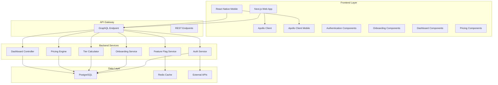
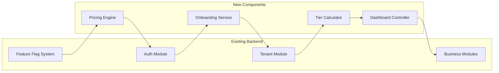

# Design Document

## Overview

This design document outlines the architecture for a comprehensive tier-based authentication and onboarding system for a multi-tenant business management platform. The system leverages existing NestJS backend infrastructure while introducing modern frontend components with progressive onboarding, dynamic tier-based access control, and AI-powered plan recommendations.

The design follows industry best practices for SaaS tiered pricing models, progressive disclosure patterns, and GraphQL authorization strategies. Key research findings indicate that successful SaaS platforms use 3-4 tier structures with clear value propositions, progressive onboarding reduces cognitive load and improves completion rates, and authorization should be implemented at the business logic layer rather than the GraphQL layer.

## Architecture

### High-Level System Architecture



### Service Integration Architecture



## Components and Interfaces

### Authentication System

**Enhanced Social Login Component**
- Integrates with existing JWT-based auth module
- Supports Google OAuth 2.0 and Facebook Login
- Handles mobile OAuth flows with deep linking
- Provides fallback to email/password registration

```typescript
interface SocialAuthProvider {
  provider: 'google' | 'facebook';
  clientId: string;
  redirectUri: string;
  scopes: string[];
}

interface AuthenticationResult {
  user: User;
  token: string;
  refreshToken: string;
  requiresOnboarding: boolean;
}
```

**JWT Token Enhancement**
- Extends existing token structure with tier information
- Includes feature flags for client-side authorization
- Maintains backward compatibility with existing auth flows

```typescript
interface EnhancedJWTPayload {
  userId: string;
  tenantId: string;
  businessTier: BusinessTier;
  permissions: Permission[];
  featureFlags: FeatureFlag[];
  trialExpiresAt?: Date;
}
```

### Progressive Onboarding Service

**Multi-Step Workflow Engine**
- State machine-based step progression
- Persistent step completion tracking
- Conditional step logic based on business type
- Integration with existing tenant creation flow

```typescript
interface OnboardingStep {
  id: string;
  title: string;
  description: string;
  component: React.ComponentType;
  validation: ValidationSchema;
  isRequired: boolean;
  dependsOn?: string[];
}

interface OnboardingState {
  currentStep: number;
  completedSteps: string[];
  businessProfile: BusinessProfile;
  selectedTier?: BusinessTier;
  isComplete: boolean;
}
```

**Business Profile Collection**
- Industry classification with predefined categories
- Business size estimation (employees, locations)
- Usage expectation gathering (transactions, revenue)
- Integration with existing tenant business type calculation

```typescript
interface BusinessProfile {
  businessName: string;
  industry: IndustryType;
  businessType: BusinessType;
  employeeCount: number;
  locationCount: number;
  expectedTransactions: number;
  expectedRevenue: number;
  currentSoftware?: string[];
}
```

### AI-Powered Pricing Engine

**Recommendation Algorithm**
- Rule-based tier recommendation using business profile data
- Confidence scoring for recommendations
- Alternative tier suggestions with reasoning
- Integration with existing tier calculation logic

```typescript
interface TierRecommendation {
  recommendedTier: BusinessTier;
  confidence: number;
  reasoning: string[];
  alternatives: {
    tier: BusinessTier;
    reason: string;
    savings?: number;
  }[];
}

interface PricingCalculator {
  calculateRecommendation(profile: BusinessProfile): TierRecommendation;
  calculateUpgradePrice(currentTier: BusinessTier, targetTier: BusinessTier): PriceCalculation;
  calculateTrialEligibility(user: User): TrialEligibility;
}
```

### Tier-Based Access Control System

**Enhanced Feature Flag Service**
- Extends existing feature flag system with tier-based rules
- Real-time permission evaluation
- Progressive disclosure logic
- Client-side and server-side authorization

```typescript
interface TierBasedFeatureFlag {
  featureId: string;
  requiredTier: BusinessTier;
  isProgressive: boolean; // If true, higher tiers inherit access
  conditions?: FeatureCondition[];
}

interface FeatureAccessResult {
  hasAccess: boolean;
  reason?: string;
  upgradeRequired?: BusinessTier;
  trialAvailable?: boolean;
}
```

**GraphQL Authorization Middleware**
- Field-level authorization based on business tier
- Automatic error handling for unauthorized access
- Integration with existing RBAC system

```typescript
interface AuthorizationContext {
  user: User;
  businessTier: BusinessTier;
  permissions: Permission[];
  featureFlags: FeatureFlag[];
}

interface FieldAuthorizationRule {
  fieldPath: string;
  requiredTier: BusinessTier;
  requiredPermissions?: string[];
  customValidator?: (context: AuthorizationContext) => boolean;
}
```

### Dynamic Dashboard Controller

**Tier-Aware Component Rendering**
- Module filtering based on current tier
- Progressive feature revelation
- Upgrade prompt integration
- Performance optimization for large module sets

```typescript
interface DashboardModule {
  id: string;
  title: string;
  icon: string;
  component: React.ComponentType;
  requiredTier: BusinessTier;
  category: ModuleCategory;
  isCore: boolean;
}

interface DashboardConfiguration {
  availableModules: DashboardModule[];
  lockedModules: DashboardModule[];
  upgradePrompts: UpgradePrompt[];
  customizations: DashboardCustomization[];
}
```

## Data Models

### Enhanced User and Tenant Models

**User Model Extensions**
```typescript
interface User {
  id: string;
  email: string;
  // ... existing fields
  onboardingCompleted: boolean;
  onboardingStep?: number;
  socialProviders: SocialProvider[];
  lastTierCheck: Date;
}

interface SocialProvider {
  provider: 'google' | 'facebook';
  providerId: string;
  email: string;
  connectedAt: Date;
}
```

**Business Tier Model**
```typescript
interface BusinessTierConfig {
  tier: BusinessTier;
  displayName: string;
  description: string;
  monthlyPrice: number;
  yearlyPrice: number;
  features: TierFeature[];
  limits: TierLimits;
  trialDays: number;
}

interface TierLimits {
  maxEmployees?: number;
  maxLocations?: number;
  maxTransactions?: number;
  maxApiCalls?: number;
  storageGB?: number;
}
```

### Onboarding Data Models

**Onboarding Session**
```typescript
interface OnboardingSession {
  id: string;
  userId: string;
  startedAt: Date;
  completedAt?: Date;
  currentStep: number;
  stepData: Record<string, any>;
  businessProfile?: BusinessProfile;
  selectedTier?: BusinessTier;
  abandonedAt?: Date;
}
```

### Pricing and Subscription Models

**Subscription Management**
```typescript
interface Subscription {
  id: string;
  tenantId: string;
  tier: BusinessTier;
  status: SubscriptionStatus;
  trialEndsAt?: Date;
  billingCycle: 'monthly' | 'yearly';
  nextBillingDate: Date;
  priceOverrides?: PriceOverride[];
}

interface PriceOverride {
  reason: string;
  originalPrice: number;
  overridePrice: number;
  expiresAt?: Date;
}
```

## Correctness Properties

*A property is a characteristic or behavior that should hold true across all valid executions of a system—essentially, a formal statement about what the system should do. Properties serve as the bridge between human-readable specifications and machine-verifiable correctness guarantees.*

Before defining the correctness properties, I need to analyze the acceptance criteria from the requirements document to determine which ones can be tested as properties.

### Property Reflection

After analyzing all acceptance criteria, several properties can be consolidated to eliminate redundancy:

- Authentication success properties can be combined into one comprehensive authentication property
- Multiple tier access control properties can be unified into a single tier-based access property  
- Dashboard update properties from different sources can be consolidated into one tier change propagation property
- Tier calculation properties can be combined into one comprehensive calculation property
- Trial management properties can be unified into one trial lifecycle property
- Subscription change properties can be consolidated into one subscription management property

### Correctness Properties

**Property 1: Authentication Success Completeness**
*For any* successful authentication (social or traditional), the system should create a user account, generate a valid JWT token with appropriate permissions, and initiate onboarding for new users
**Validates: Requirements 1.3, 1.5**

**Property 2: Onboarding Workflow Consistency** 
*For any* new user, the onboarding service should initiate a 5-step workflow and preserve progress at any abandonment point, allowing resumption from the last completed step
**Validates: Requirements 2.1, 2.7, 2.8**

**Property 3: Recommendation Generation Completeness**
*For any* business profile data collected during onboarding, the pricing engine should analyze all factors (industry, size, usage expectations) and generate recommendations with reasoning
**Validates: Requirements 3.1, 3.2, 3.3**

**Property 4: Tier-Based Access Control**
*For any* feature access attempt, the system should verify the user's current tier, grant access if included, deny access with upgrade prompts if excluded, and ensure progressive disclosure (higher tiers include all lower tier features)
**Validates: Requirements 4.1, 4.2, 4.3, 4.5**

**Property 5: Tier Calculation Accuracy**
*For any* business metrics update, the tier calculator should evaluate appropriateness using all specified factors (employees, locations, transactions, revenue) and recommend upgrades when thresholds are exceeded
**Validates: Requirements 5.1, 5.2, 5.3**

**Property 6: Dashboard Tier Consistency**
*For any* dashboard access, the controller should load only tier-appropriate modules, filter navigation by current tier, and display upgrade indicators for locked features
**Validates: Requirements 6.1, 6.2, 6.3**

**Property 7: Tier Change Propagation**
*For any* tier change (upgrade, downgrade, trial start/end), all system components should update immediately to reflect new feature availability and interface state
**Validates: Requirements 4.4, 5.4, 6.5, 11.5, 12.5**

**Property 8: Plan Selection Consistency**
*For any* plan selection on the pricing page, the system should initiate the subscription process and use available onboarding data for personalized recommendations
**Validates: Requirements 7.3, 7.4**

**Property 9: Trial Lifecycle Management**
*For any* trial subscription, the system should grant full tier access during the trial period, send expiration reminders, and downgrade to free tier upon expiration unless payment is processed
**Validates: Requirements 11.2, 11.3, 11.4**

**Property 10: Subscription Change Processing**
*For any* subscription upgrade or downgrade, the system should calculate appropriate pricing (prorated for upgrades), provide confirmation with effective dates, and manage access transitions correctly
**Validates: Requirements 12.1, 12.2, 12.3, 12.4**

**Property 11: Audit Trail Completeness**
*For any* tier change or subscription modification, the system should log all changes with timestamps and reasons for audit purposes
**Validates: Requirements 5.5**

**Property 12: Feature Access Consistency**
*For any* locked feature interaction, the system should display upgrade prompts with pricing information and maintain consistent behavior across all interface components
**Validates: Requirements 6.4**

## Error Handling

### Authentication Error Scenarios

**Social Login Failures**
- OAuth provider unavailability: Graceful fallback to email/password registration
- Invalid OAuth responses: Clear error messages with retry options
- Network connectivity issues: Offline state handling with retry mechanisms
- Token validation failures: Automatic token refresh with fallback to re-authentication

**Onboarding Error Recovery**
- Step validation failures: Field-level error messages with correction guidance
- Network interruptions: Automatic progress saving with resume capability
- Data persistence errors: Retry mechanisms with user notification
- Business profile validation: Real-time validation with helpful error messages

### Tier Management Error Handling

**Tier Calculation Errors**
- Missing business metrics: Default tier assignment with upgrade prompts
- Calculation service unavailability: Cached tier information with background retry
- Threshold evaluation errors: Conservative tier assignment with manual review flags
- Database inconsistencies: Automatic reconciliation with audit logging

**Feature Access Errors**
- Permission evaluation failures: Fail-safe to deny access with clear error messages
- Feature flag service unavailability: Cached permissions with degraded functionality warnings
- Real-time update failures: Background synchronization with user notification
- Authorization token expiry: Seamless token refresh with maintained user session

### Payment and Subscription Errors

**Trial Management Errors**
- Trial expiration processing failures: Grace period extension with notification
- Payment processing errors: Multiple retry attempts with user communication
- Downgrade processing failures: Maintained access with background retry
- Notification delivery failures: Multiple channel attempts (email, in-app, SMS)

**Subscription Change Errors**
- Prorated pricing calculation errors: Conservative pricing with manual review
- Immediate access grant failures: Rollback with user notification and support escalation
- Billing cycle calculation errors: Default to user-favorable terms with correction
- Interface update failures: Background synchronization with manual refresh option

## Testing Strategy

### Dual Testing Approach

The testing strategy employs both unit testing and property-based testing to ensure comprehensive coverage:

**Unit Tests** focus on:
- Specific authentication flow examples (Google OAuth, Facebook Login)
- Individual onboarding step validation
- Edge cases in tier calculation (boundary conditions, missing data)
- Error condition handling (network failures, invalid inputs)
- Integration points between services
- UI component rendering with different tier states

**Property-Based Tests** focus on:
- Universal properties that hold across all inputs
- Comprehensive input coverage through randomization
- Tier-based access control across all feature combinations
- Onboarding workflow consistency across all user profiles
- Pricing calculation accuracy across all business profiles

### Property-Based Testing Configuration

**Testing Framework**: Fast-check for TypeScript/JavaScript components
**Test Configuration**: Minimum 100 iterations per property test
**Test Tagging**: Each property test references its design document property

Example property test structure:
```typescript
// Feature: tier-based-auth-onboarding, Property 4: Tier-Based Access Control
fc.assert(fc.property(
  fc.record({
    user: userGenerator,
    feature: featureGenerator,
    tier: tierGenerator
  }),
  ({ user, feature, tier }) => {
    const hasAccess = featureAccessService.checkAccess(user, feature, tier);
    const shouldHaveAccess = tier.features.includes(feature.id) || 
                           tier.progressiveFeatures.some(f => f.includes(feature.id));
    return hasAccess === shouldHaveAccess;
  }
), { numRuns: 100 });
```

### Integration Testing Strategy

**GraphQL API Testing**
- Authorization middleware validation across all resolvers
- Tier-based field access control verification
- Real-time subscription updates for tier changes
- Performance testing for dashboard module loading

**Frontend Integration Testing**
- Cross-browser compatibility for authentication flows
- Mobile responsive design validation
- Animation performance across different devices
- Accessibility compliance for all onboarding components

**End-to-End Testing**
- Complete user registration and onboarding flows
- Tier upgrade and downgrade scenarios
- Trial expiration and renewal processes
- Multi-tenant isolation verification

### Performance Testing Requirements

**Dashboard Loading Performance**
- Target: <500ms for dashboard component rendering
- Test across all tier configurations
- Validate with realistic data volumes
- Monitor memory usage during tier transitions

**Authentication Flow Performance**
- Target: <2 seconds for complete social login flow
- Test OAuth provider response variations
- Validate mobile deep linking performance
- Monitor token generation and validation times

**Real-time Update Performance**
- Target: <100ms for tier change propagation
- Test concurrent user tier changes
- Validate WebSocket connection stability
- Monitor database query performance under load