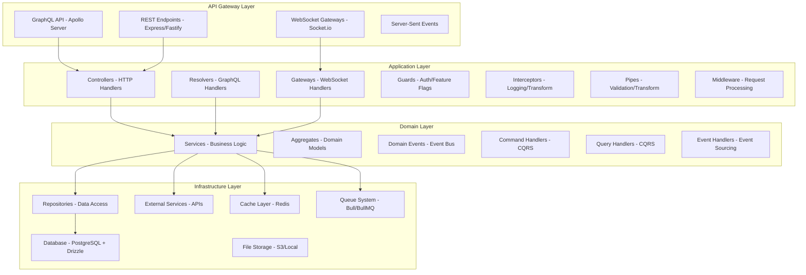
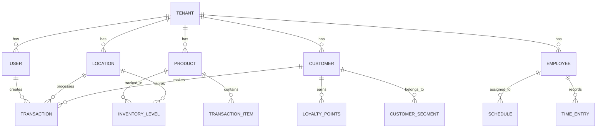

# Design Document: Unified Business Platform

## Overview

The Unified Business Platform is architected as a production-grade, enterprise-level monolithic NestJS application that serves businesses across all scales through progressive feature disclosure. The system leverages NestJS's full ecosystem including GraphQL with Apollo Server, Drizzle ORM with PostgreSQL, Redis for caching and queues, WebSocket gateways for real-time features, and comprehensive security frameworks to deliver a scalable, performant, and maintainable solution.

The architecture follows Domain-Driven Design (DDD) principles with clear bounded contexts, implements CQRS for complex operations, uses event-driven patterns for real-time synchronization, and employs advanced NestJS patterns including custom decorators, interceptors, guards, and pipes. The system is designed to handle millions of transactions while maintaining sub-200ms response times for critical operations through intelligent caching, connection pooling, and optimized database queries.

## Architecture

### High-Level Architecture

The system follows a sophisticated layered architecture with clear separation of concerns and leverages all NestJS capabilities:



### Core Architectural Principles

1. **Progressive Disclosure Architecture**: Single codebase with feature flags controlling access based on business tier
2. **Multi-Tenant Isolation**: Complete data isolation using tenant_id with row-level security
3. **Offline-First Design**: Local data caching with intelligent synchronization
4. **Event-Driven Architecture**: Domain events for loose coupling and real-time updates
5. **CQRS Implementation**: Separate read/write models for complex operations
6. **Microservices-Ready Patterns**: Modular design enabling future service extraction 

## Components and Interfaces

### Core Infrastructure Modules

#### 1. Authentication & Authorization Module (`auth.module.ts`)

**Purpose**: Comprehensive authentication and authorization system supporting multiple strategies and progressive feature access.

**Key Components**:
- `AuthService`: JWT token management, refresh token rotation, session handling
- `AuthController`: Login, logout, refresh token endpoints
- `JwtStrategy`: JWT token validation using Passport
- `LocalStrategy`: Username/password authentication
- `OAuth2Strategy`: Social login integration (Google, Facebook, GitHub)
- `SAMLStrategy`: Enterprise SSO for large customers
- `AuthGuard`: Route protection with role-based access control
- `FeatureGuard`: Progressive feature access based on business tier
- `TenantGuard`: Multi-tenant data isolation enforcement

**NestJS Features Utilized**:
- `@nestjs/passport` for authentication strategies
- `@nestjs/jwt` for token management
- Custom guards with `@Injectable()` and `CanActivate`
- Custom decorators for user context (`@CurrentUser()`, `@CurrentTenant()`)
- Interceptors for audit logging
- Exception filters for authentication errors

**Interfaces**:
```typescript
interface AuthenticatedUser {
  id: string;
  email: string;
  tenantId: string;
  roles: Role[];
  permissions: Permission[];
  businessTier: BusinessTier;
}

interface JwtPayload {
  sub: string;
  email: string;
  tenantId: string;
  roles: string[];
  iat: number;
  exp: number;
}
```

#### 2. Multi-Tenancy Module (`tenant.module.ts`)

**Purpose**: Complete tenant isolation and management system with automatic tier detection.

**Key Components**:
- `TenantService`: Tenant creation, configuration, tier management
- `TenantResolver`: GraphQL operations for tenant management
- `TenantInterceptor`: Automatic tenant context injection
- `TenantGuard`: Tenant access validation
- `BusinessTierService`: Automatic tier calculation based on metrics
- `FeatureFlagService`: Dynamic feature flag evaluation

**Database Design**:
- Row-level security (RLS) policies for complete data isolation
- Tenant-specific configuration tables
- Automatic tenant_id injection in all queries
- Tenant metrics tracking for tier calculation

#### 3. Feature Flag System (`feature-flag.module.ts`)

**Purpose**: Dynamic feature unlocking based on business growth metrics.

**Key Components**:
- `FeatureFlagService`: Feature evaluation engine
- `@RequireFeature()` decorator: Route-level feature protection
- `@RequireTier()` decorator: Business tier validation
- `FeatureFlagInterceptor`: Performance-optimized feature checking
- `BusinessMetricsService`: Real-time metrics calculation

**Feature Flag Logic**:
```typescript
interface FeatureFlag {
  name: string;
  requiredTier: BusinessTier;
  customRules?: FeatureRule[];
  enabled: boolean;
  rolloutPercentage?: number;
}

interface BusinessMetrics {
  employeeCount: number;
  locationCount: number;
  monthlyTransactionVolume: number;
  monthlyRevenue: number;
}
```

### Business Domain Modules

#### 4. Point of Sale Module (`pos.module.ts`)

**Purpose**: High-performance transaction processing with offline capabilities.

**Key Components**:
- `POSService`: Transaction processing, payment handling
- `POSController`: REST endpoints for POS operations
- `POSResolver`: GraphQL mutations for transactions
- `TransactionService`: Transaction lifecycle management
- `PaymentService`: Multi-provider payment processing
- `ReceiptService`: Receipt generation and delivery
- `OfflineQueueService`: Offline transaction queuing

**Performance Optimizations**:
- Redis caching for product lookups
- Connection pooling for database operations
- Optimistic locking for inventory updates
- Background job processing for non-critical operations

#### 5. Inventory Management Module (`inventory.module.ts`)

**Purpose**: Real-time inventory tracking across multiple locations with advanced forecasting.

**Key Components**:
- `InventoryService`: Stock level management, reorder calculations
- `ProductService`: Product catalog management with variants
- `StockMovementService`: Inventory transaction tracking
- `ReorderService`: Automated reorder point calculations
- `InventoryResolver`: GraphQL operations for inventory
- `StockAdjustmentService`: Manual stock adjustments with audit trails
- `ForecastingService`: AI-driven demand forecasting

**Real-time Features**:
- WebSocket notifications for stock level changes
- Event-driven inventory updates across locations
- Real-time synchronization using Redis pub/sub

#### 6. Customer Relationship Management Module (`crm.module.ts`)

**Purpose**: Comprehensive customer management with segmentation and loyalty programs.

**Key Components**:
- `CustomerService`: Customer profile management
- `LoyaltyService`: Points, tiers, and rewards management
- `SegmentationService`: Customer segmentation engine
- `CampaignService`: Marketing campaign management
- `CustomerResolver`: GraphQL operations for CRM
- `CustomerAnalyticsService`: Customer behavior analytics

#### 7. Employee Management Module (`employee.module.ts`)

**Purpose**: Complete HR functionality with scheduling, time tracking, and performance management.

**Key Components**:
- `EmployeeService`: Employee profile and role management
- `SchedulingService`: Employee scheduling with conflict resolution
- `TimeTrackingService`: Clock-in/out with geolocation validation
- `PayrollService`: Payroll calculation and reporting
- `PerformanceService`: Performance tracking and reviews
- `EmployeeResolver`: GraphQL operations for HR

#### 8. Financial Management Module (`financial.module.ts`)

**Purpose**: Complete accounting system with real-time financial reporting.

**Key Components**:
- `AccountingService`: Chart of accounts, journal entries
- `ReportingService`: Financial report generation
- `BudgetService`: Budget creation and variance analysis
- `TaxService`: Multi-jurisdiction tax calculation
- `FinancialResolver`: GraphQL operations for financials
- `AuditService`: Financial audit trail management

### Infrastructure Services

#### 9. Database Module (`database.module.ts`)

**Purpose**: High-performance database layer with Drizzle ORM and PostgreSQL.

**Key Components**:
- `DatabaseService`: Connection management and health checks
- `MigrationService`: Database schema migrations
- `SeedService`: Test data seeding
- Custom Drizzle schemas with multi-tenancy support
- Connection pooling configuration
- Read replica support for reporting queries

**Database Optimizations**:
- Prepared statements for frequently used queries
- Materialized views for complex reporting
- Partitioning for large transaction tables
- Comprehensive indexing strategy

#### 10. Cache Module (`cache.module.ts`)

**Purpose**: Multi-layer caching system using Redis for optimal performance.

**Key Components**:
- `CacheService`: Intelligent cache management
- `CacheInterceptor`: Automatic response caching
- Custom cache decorators (`@Cacheable()`, `@CacheEvict()`)
- Cache warming strategies
- Distributed cache invalidation

#### 11. Queue Module (`queue.module.ts`)

**Purpose**: Background job processing using Bull/BullMQ with Redis.

**Key Components**:
- `QueueService`: Job queue management
- `EmailProcessor`: Email sending jobs
- `ReportProcessor`: Report generation jobs
- `SyncProcessor`: Data synchronization jobs
- `NotificationProcessor`: Push notification jobs
- Job retry and failure handling

#### 12. Real-time Module (`realtime.module.ts`)

**Purpose**: WebSocket-based real-time communication system.

**Key Components**:
- `RealtimeGateway`: WebSocket connection management
- `NotificationService`: Real-time notification delivery
- `LiveUpdatesService`: Real-time data synchronization
- Room-based messaging for tenant isolation
- Connection authentication and authorization

#### 13. Integration Module (`integration.module.ts`)

**Purpose**: Third-party service integration platform.

**Key Components**:
- `IntegrationService`: Integration lifecycle management
- `WebhookService`: Webhook delivery and verification
- `APIClientService`: External API communication
- Pre-built connectors for popular services
- Integration health monitoring

### Data Models

#### Core Entity Relationships



#### Database Schema Design (Drizzle)

**Multi-Tenant Base Schema**:
```typescript
// Base schema for all tenant-isolated tables
export const baseSchema = {
  id: uuid('id').primaryKey().defaultRandom(),
  tenantId: uuid('tenant_id').notNull().references(() => tenants.id),
  createdAt: timestamp('created_at').defaultNow().notNull(),
  updatedAt: timestamp('updated_at').defaultNow().notNull(),
  createdBy: uuid('created_by').references(() => users.id),
  updatedBy: uuid('updated_by').references(() => users.id),
  deletedAt: timestamp('deleted_at'),
  version: integer('version').default(1).notNull(),
};

// Tenant table
export const tenants = pgTable('tenants', {
  ...baseSchema,
  name: varchar('name', { length: 255 }).notNull(),
  businessTier: businessTierEnum('business_tier').notNull(),
  subscriptionStatus: subscriptionStatusEnum('subscription_status').notNull(),
  settings: jsonb('settings').default({}),
  featureFlags: jsonb('feature_flags').default({}),
  metrics: jsonb('metrics').default({}),
});

// User table with multi-tenant support
export const users = pgTable('users', {
  ...baseSchema,
  email: varchar('email', { length: 255 }).notNull().unique(),
  passwordHash: varchar('password_hash', { length: 255 }),
  firstName: varchar('first_name', { length: 100 }),
  lastName: varchar('last_name', { length: 100 }),
  roles: jsonb('roles').default([]),
  permissions: jsonb('permissions').default([]),
  lastLoginAt: timestamp('last_login_at'),
  isActive: boolean('is_active').default(true),
});

// Product table with variant support
export const products = pgTable('products', {
  ...baseSchema,
  sku: varchar('sku', { length: 100 }).notNull(),
  name: varchar('name', { length: 255 }).notNull(),
  description: text('description'),
  category: varchar('category', { length: 100 }),
  basePrice: decimal('base_price', { precision: 10, scale: 2 }),
  costPrice: decimal('cost_price', { precision: 10, scale: 2 }),
  variants: jsonb('variants').default([]),
  attributes: jsonb('attributes').default({}),
  isActive: boolean('is_active').default(true),
});
```

**Performance Indexes**:
```typescript
// Multi-column indexes for tenant isolation and performance
export const tenantUserIndex = index('idx_users_tenant_email')
  .on(users.tenantId, users.email);

export const tenantProductIndex = index('idx_products_tenant_sku')
  .on(products.tenantId, products.sku);

export const transactionDateIndex = index('idx_transactions_tenant_date')
  .on(transactions.tenantId, transactions.createdAt);
```

### API Design

#### GraphQL Schema Architecture

**Code-First Approach with TypeGraphQL Integration**:

```typescript
// Base entity with tenant isolation
@ObjectType()
export abstract class BaseEntity {
  @Field(() => ID)
  id: string;

  @Field()
  tenantId: string;

  @Field()
  createdAt: Date;

  @Field()
  updatedAt: Date;

  @Field({ nullable: true })
  deletedAt?: Date;
}

// Product GraphQL type
@ObjectType()
export class Product extends BaseEntity {
  @Field()
  sku: string;

  @Field()
  name: string;

  @Field({ nullable: true })
  description?: string;

  @Field(() => GraphQLDecimal)
  basePrice: number;

  @Field(() => [ProductVariant])
  variants: ProductVariant[];

  @Field(() => [InventoryLevel])
  inventoryLevels: InventoryLevel[];
}

// Product input types
@InputType()
export class CreateProductInput {
  @Field()
  @IsNotEmpty()
  @Length(1, 100)
  sku: string;

  @Field()
  @IsNotEmpty()
  @Length(1, 255)
  name: string;

  @Field({ nullable: true })
  @IsOptional()
  @Length(0, 1000)
  description?: string;

  @Field(() => GraphQLDecimal)
  @IsPositive()
  basePrice: number;
}
```

**GraphQL Resolvers with Advanced Features**:

```typescript
@Resolver(() => Product)
export class ProductResolver {
  constructor(
    private readonly productService: ProductService,
    private readonly inventoryService: InventoryService,
  ) {}

  @Query(() => [Product])
  @RequireFeature('inventory-management')
  @RequirePermission('products:read')
  async products(
    @Args() args: ProductsArgs,
    @CurrentTenant() tenantId: string,
  ): Promise<Product[]> {
    return this.productService.findAll(tenantId, args);
  }

  @Mutation(() => Product)
  @RequireFeature('inventory-management')
  @RequirePermission('products:create')
  async createProduct(
    @Args('input') input: CreateProductInput,
    @CurrentUser() user: AuthenticatedUser,
  ): Promise<Product> {
    return this.productService.create(user.tenantId, input, user.id);
  }

  @ResolveField(() => [InventoryLevel])
  async inventoryLevels(
    @Parent() product: Product,
    @CurrentTenant() tenantId: string,
  ): Promise<InventoryLevel[]> {
    return this.inventoryService.findByProduct(tenantId, product.id);
  }

  @Subscription(() => Product)
  @RequireFeature('real-time-updates')
  productUpdated(
    @Args('productId') productId: string,
    @CurrentTenant() tenantId: string,
  ) {
    return this.productService.subscribeToUpdates(tenantId, productId);
  }
}
```

#### REST API Design

**Controller with Advanced NestJS Features**:

```typescript
@Controller('api/v1/pos')
@UseGuards(AuthGuard, TenantGuard, FeatureGuard)
@RequireFeature('point-of-sale')
@UseInterceptors(LoggingInterceptor, CacheInterceptor)
@ApiTags('Point of Sale')
export class POSController {
  constructor(
    private readonly posService: POSService,
    private readonly auditService: AuditService,
  ) {}

  @Post('transactions')
  @RequirePermission('pos:create-transaction')
  @HttpCode(HttpStatus.CREATED)
  @ApiOperation({ summary: 'Process a sale transaction' })
  @ApiResponse({ status: 201, type: Transaction })
  async processTransaction(
    @Body(ValidationPipe) dto: CreateTransactionDto,
    @CurrentUser() user: AuthenticatedUser,
    @CurrentTenant() tenantId: string,
  ): Promise<Transaction> {
    const transaction = await this.posService.processTransaction(
      tenantId,
      dto,
      user.id,
    );
    
    // Emit real-time event
    this.eventEmitter.emit('transaction.created', {
      tenantId,
      transaction,
      userId: user.id,
    });
    
    return transaction;
  }

  @Get('transactions/:id')
  @RequirePermission('pos:read-transaction')
  @ApiParam({ name: 'id', type: 'string' })
  async getTransaction(
    @Param('id', ParseUUIDPipe) id: string,
    @CurrentTenant() tenantId: string,
  ): Promise<Transaction> {
    return this.posService.findTransaction(tenantId, id);
  }

  @Post('transactions/:id/void')
  @RequirePermission('pos:void-transaction')
  @RequireTier('small-business')
  @ApiOperation({ summary: 'Void a transaction' })
  async voidTransaction(
    @Param('id', ParseUUIDPipe) id: string,
    @Body() dto: VoidTransactionDto,
    @CurrentUser() user: AuthenticatedUser,
    @CurrentTenant() tenantId: string,
  ): Promise<Transaction> {
    return this.posService.voidTransaction(tenantId, id, dto, user.id);
  }
}
```

### Security Architecture

#### Multi-Layer Security Implementation

**1. Authentication Strategies**:
```typescript
// JWT Strategy with tenant validation
@Injectable()
export class JwtStrategy extends PassportStrategy(Strategy) {
  constructor(
    private readonly authService: AuthService,
    private readonly tenantService: TenantService,
  ) {
    super({
      jwtFromRequest: ExtractJwt.fromAuthHeaderAsBearerToken(),
      ignoreExpiration: false,
      secretOrKey: process.env.JWT_SECRET,
    });
  }

  async validate(payload: JwtPayload): Promise<AuthenticatedUser> {
    const user = await this.authService.validateUser(payload.sub);
    const tenant = await this.tenantService.findById(payload.tenantId);
    
    if (!user || !tenant || !user.isActive || !tenant.isActive) {
      throw new UnauthorizedException('Invalid token');
    }

    return {
      id: user.id,
      email: user.email,
      tenantId: tenant.id,
      roles: user.roles,
      permissions: user.permissions,
      businessTier: tenant.businessTier,
    };
  }
}
```

**2. Authorization Guards**:
```typescript
// Feature flag guard with caching
@Injectable()
export class FeatureGuard implements CanActivate {
  constructor(
    private readonly reflector: Reflector,
    private readonly featureFlagService: FeatureFlagService,
    private readonly cacheManager: Cache,
  ) {}

  async canActivate(context: ExecutionContext): Promise<boolean> {
    const requiredFeature = this.reflector.get<string>(
      'feature',
      context.getHandler(),
    );

    if (!requiredFeature) {
      return true;
    }

    const request = context.switchToHttp().getRequest();
    const user: AuthenticatedUser = request.user;
    
    // Check cache first for performance
    const cacheKey = `feature:${user.tenantId}:${requiredFeature}`;
    let hasFeature = await this.cacheManager.get<boolean>(cacheKey);
    
    if (hasFeature === undefined) {
      hasFeature = await this.featureFlagService.hasFeature(
        user.tenantId,
        requiredFeature,
        user.businessTier,
      );
      
      // Cache for 5 minutes
      await this.cacheManager.set(cacheKey, hasFeature, 300);
    }

    if (!hasFeature) {
      throw new ForbiddenException({
        message: 'Feature not available for your business tier',
        feature: requiredFeature,
        currentTier: user.businessTier,
        upgradeRequired: true,
      });
    }

    return true;
  }
}
```

**3. Data Encryption and Security**:
```typescript
// Field-level encryption service
@Injectable()
export class EncryptionService {
  private readonly algorithm = 'aes-256-gcm';
  private readonly keyLength = 32;

  async encryptField(data: string, tenantId: string): Promise<string> {
    const key = await this.getTenantKey(tenantId);
    const iv = crypto.randomBytes(16);
    const cipher = crypto.createCipher(this.algorithm, key);
    
    let encrypted = cipher.update(data, 'utf8', 'hex');
    encrypted += cipher.final('hex');
    
    const authTag = cipher.getAuthTag();
    
    return `${iv.toString('hex')}:${authTag.toString('hex')}:${encrypted}`;
  }

  async decryptField(encryptedData: string, tenantId: string): Promise<string> {
    const [ivHex, authTagHex, encrypted] = encryptedData.split(':');
    const key = await this.getTenantKey(tenantId);
    
    const iv = Buffer.from(ivHex, 'hex');
    const authTag = Buffer.from(authTagHex, 'hex');
    
    const decipher = crypto.createDecipher(this.algorithm, key);
    decipher.setAuthTag(authTag);
    
    let decrypted = decipher.update(encrypted, 'hex', 'utf8');
    decrypted += decipher.final('utf8');
    
    return decrypted;
  }
}
```

### Performance Optimization

#### Caching Strategy

**Multi-Layer Caching Implementation**:
```typescript
// Intelligent caching service
@Injectable()
export class IntelligentCacheService {
  constructor(
    @Inject(CACHE_MANAGER) private cacheManager: Cache,
    private readonly redisService: RedisService,
  ) {}

  // L1: In-memory cache for frequently accessed data
  private memoryCache = new Map<string, { data: any; expiry: number }>();

  async get<T>(key: string): Promise<T | null> {
    // Check L1 cache first
    const memoryData = this.memoryCache.get(key);
    if (memoryData && memoryData.expiry > Date.now()) {
      return memoryData.data;
    }

    // Check L2 cache (Redis)
    const redisData = await this.cacheManager.get<T>(key);
    if (redisData) {
      // Populate L1 cache
      this.memoryCache.set(key, {
        data: redisData,
        expiry: Date.now() + 60000, // 1 minute L1 cache
      });
      return redisData;
    }

    return null;
  }

  async set<T>(key: string, value: T, ttl: number): Promise<void> {
    // Set in both caches
    await this.cacheManager.set(key, value, ttl);
    this.memoryCache.set(key, {
      data: value,
      expiry: Date.now() + Math.min(ttl * 1000, 60000),
    });
  }

  async invalidatePattern(pattern: string): Promise<void> {
    // Invalidate Redis cache
    const keys = await this.redisService.keys(pattern);
    if (keys.length > 0) {
      await this.redisService.del(...keys);
    }

    // Invalidate memory cache
    for (const key of this.memoryCache.keys()) {
      if (key.match(pattern)) {
        this.memoryCache.delete(key);
      }
    }
  }
}
```

#### Database Optimization

**Connection Pooling and Query Optimization**:
```typescript
// Optimized database service
@Injectable()
export class OptimizedDatabaseService {
  constructor(
    private readonly drizzle: DrizzleService,
    private readonly cacheService: IntelligentCacheService,
  ) {}

  // Prepared statement cache
  private preparedStatements = new Map<string, any>();

  async executeOptimizedQuery<T>(
    query: string,
    params: any[],
    cacheKey?: string,
    cacheTTL: number = 300,
  ): Promise<T[]> {
    // Check cache first
    if (cacheKey) {
      const cached = await this.cacheService.get<T[]>(cacheKey);
      if (cached) {
        return cached;
      }
    }

    // Use prepared statement for performance
    let stmt = this.preparedStatements.get(query);
    if (!stmt) {
      stmt = this.drizzle.prepare(query);
      this.preparedStatements.set(query, stmt);
    }

    const result = await stmt.execute(params);

    // Cache result
    if (cacheKey) {
      await this.cacheService.set(cacheKey, result, cacheTTL);
    }

    return result;
  }

  // Batch operations for better performance
  async batchInsert<T>(table: string, records: T[]): Promise<void> {
    const batchSize = 1000;
    const batches = [];

    for (let i = 0; i < records.length; i += batchSize) {
      batches.push(records.slice(i, i + batchSize));
    }

    await Promise.all(
      batches.map(batch => this.drizzle.insert(table).values(batch))
    );
  }
}
```

### Real-Time Architecture

#### WebSocket Gateway Implementation

```typescript
@WebSocketGateway({
  cors: {
    origin: process.env.FRONTEND_URL,
    credentials: true,
  },
  namespace: '/realtime',
})
export class RealtimeGateway implements OnGatewayConnection, OnGatewayDisconnect {
  @WebSocketServer()
  server: Server;

  constructor(
    private readonly authService: AuthService,
    private readonly tenantService: TenantService,
    private readonly logger: Logger,
  ) {}

  async handleConnection(client: Socket) {
    try {
      // Authenticate WebSocket connection
      const token = client.handshake.auth.token;
      const user = await this.authService.validateToken(token);
      
      // Join tenant-specific room
      client.join(`tenant:${user.tenantId}`);
      client.data.user = user;
      
      this.logger.log(`Client connected: ${client.id} for tenant: ${user.tenantId}`);
    } catch (error) {
      this.logger.error(`WebSocket authentication failed: ${error.message}`);
      client.disconnect();
    }
  }

  handleDisconnect(client: Socket) {
    const user = client.data.user;
    if (user) {
      this.logger.log(`Client disconnected: ${client.id} for tenant: ${user.tenantId}`);
    }
  }

  @SubscribeMessage('subscribe-inventory')
  @RequireFeature('real-time-inventory')
  async handleInventorySubscription(
    @ConnectedSocket() client: Socket,
    @MessageBody() data: { locationId?: string },
  ) {
    const user = client.data.user;
    const room = data.locationId 
      ? `inventory:${user.tenantId}:${data.locationId}`
      : `inventory:${user.tenantId}`;
    
    client.join(room);
    return { status: 'subscribed', room };
  }

  // Emit inventory updates to subscribed clients
  async emitInventoryUpdate(tenantId: string, locationId: string, update: any) {
    this.server
      .to(`inventory:${tenantId}:${locationId}`)
      .emit('inventory-updated', update);
  }
}
```

### Event-Driven Architecture

#### Domain Events Implementation

```typescript
// Domain event base class
export abstract class DomainEvent {
  public readonly occurredOn: Date;
  public readonly eventId: string;
  public readonly tenantId: string;

  constructor(tenantId: string) {
    this.occurredOn = new Date();
    this.eventId = randomUUID();
    this.tenantId = tenantId;
  }
}

// Specific domain events
export class TransactionCreatedEvent extends DomainEvent {
  constructor(
    tenantId: string,
    public readonly transactionId: string,
    public readonly customerId: string,
    public readonly locationId: string,
    public readonly total: number,
    public readonly items: TransactionItem[],
  ) {
    super(tenantId);
  }
}

export class InventoryLevelChangedEvent extends DomainEvent {
  constructor(
    tenantId: string,
    public readonly productId: string,
    public readonly locationId: string,
    public readonly previousLevel: number,
    public readonly newLevel: number,
    public readonly changeReason: string,
  ) {
    super(tenantId);
  }
}

// Event handlers
@EventsHandler(TransactionCreatedEvent)
export class TransactionCreatedHandler implements IEventHandler<TransactionCreatedEvent> {
  constructor(
    private readonly inventoryService: InventoryService,
    private readonly loyaltyService: LoyaltyService,
    private readonly analyticsService: AnalyticsService,
    private readonly realtimeGateway: RealtimeGateway,
  ) {}

  async handle(event: TransactionCreatedEvent) {
    // Update inventory levels
    await this.inventoryService.updateStockLevels(
      event.tenantId,
      event.locationId,
      event.items,
    );

    // Update customer loyalty points
    await this.loyaltyService.addPoints(
      event.tenantId,
      event.customerId,
      event.total,
    );

    // Update analytics
    await this.analyticsService.recordSale(event);

    // Emit real-time updates
    await this.realtimeGateway.emitTransactionUpdate(
      event.tenantId,
      event.locationId,
      {
        transactionId: event.transactionId,
        total: event.total,
        timestamp: event.occurredOn,
      },
    );
  }
}
```

### Offline-First Architecture

#### Synchronization Service

```typescript
@Injectable()
export class OfflineSyncService {
  constructor(
    private readonly queueService: QueueService,
    private readonly conflictResolver: ConflictResolverService,
    private readonly cacheService: IntelligentCacheService,
  ) {}

  // Queue offline operations
  async queueOfflineOperation(
    tenantId: string,
    operation: OfflineOperation,
  ): Promise<void> {
    const queueKey = `offline:${tenantId}`;
    await this.queueService.add('sync-offline-operations', {
      tenantId,
      operation,
      timestamp: Date.now(),
    });
  }

  // Process offline operations when back online
  @Process('sync-offline-operations')
  async processOfflineOperations(job: Job<OfflineSyncData>) {
    const { tenantId, operation } = job.data;

    try {
      // Check for conflicts
      const conflicts = await this.conflictResolver.detectConflicts(
        tenantId,
        operation,
      );

      if (conflicts.length > 0) {
        // Handle conflicts based on resolution strategy
        await this.conflictResolver.resolveConflicts(tenantId, conflicts);
      }

      // Apply operation
      await this.applyOperation(tenantId, operation);

      // Mark as synced
      await this.markAsSynced(tenantId, operation.id);
    } catch (error) {
      // Retry logic
      throw error;
    }
  }

  // Intelligent sync prioritization
  async prioritizeSync(tenantId: string): Promise<OfflineOperation[]> {
    const operations = await this.getPendingOperations(tenantId);
    
    // Priority order: POS transactions > Inventory > Customer > Others
    return operations.sort((a, b) => {
      const priorityMap = {
        'pos-transaction': 1,
        'inventory-update': 2,
        'customer-update': 3,
        'other': 4,
      };
      
      return priorityMap[a.type] - priorityMap[b.type];
    });
  }
}
```
## Correctness Properties

*A property is a characteristic or behavior that should hold true across all valid executions of a system—essentially, a formal statement about what the system should do. Properties serve as the bridge between human-readable specifications and machine-verifiable correctness guarantees.*

The following correctness properties define the formal specifications that our unified business platform must satisfy. Each property is designed to be tested using property-based testing with generated inputs to ensure the system behaves correctly across all possible scenarios.

### Security and Isolation Properties

**Property 1: Complete Tenant Data Isolation**
*For any* two different tenants and any database operation, data belonging to one tenant should never be accessible to users of another tenant, ensuring complete multi-tenant isolation.
**Validates: Requirements 1.1, 1.2**

**Property 2: Automatic Tenant Filtering**
*For any* database query executed by the system, the query should automatically include tenant_id filtering to prevent cross-tenant data access.
**Validates: Requirements 1.3**

**Property 3: Data Encryption Consistency**
*For any* sensitive data stored or transmitted by the system, the data should be encrypted using industry-standard algorithms and remain encrypted at rest and in transit.
**Validates: Requirements 16.1**

**Property 4: Immutable Audit Trail**
*For any* system operation that modifies data, an audit log entry should be created with an immutable timestamp and complete operation details.
**Validates: Requirements 16.3**

### Feature Flag and Progressive Disclosure Properties

**Property 5: Automatic Feature Unlocking**
*For any* business that meets the defined growth thresholds (employee count, location count, transaction volume), the appropriate tier features should be automatically unlocked without manual intervention.
**Validates: Requirements 2.1**

**Property 6: Real-time Feature Evaluation**
*For any* feature access check, the system should evaluate current business metrics in real-time and return the correct feature availability status.
**Validates: Requirements 2.2**

### Performance Properties

**Property 7: POS Transaction Performance**
*For any* valid POS transaction, the system should complete the transaction processing in under 200ms from request to response.
**Validates: Requirements 4.1, 18.1**

**Property 8: System Scalability**
*For any* load up to 10,000 concurrent users, the system should maintain response times within acceptable limits and not degrade below performance thresholds.
**Validates: Requirements 18.3**

### Business Logic Properties

**Property 9: Receipt Generation Completeness**
*For any* completed transaction, the system should successfully generate and deliver receipts through at least one of the specified channels (SMS, email, or print).
**Validates: Requirements 4.4**

**Property 10: Authorization for Sensitive Operations**
*For any* attempt to perform sensitive operations (refunds, voids, price changes), the system should verify proper authorization before allowing the operation to proceed.
**Validates: Requirements 4.8**

### Inventory Management Properties

**Property 11: Real-time Inventory Synchronization**
*For any* inventory change at any location, the updated stock levels should be immediately reflected across all locations within the same tenant.
**Validates: Requirements 5.1**

**Property 12: Automated Reorder Alerts**
*For any* product whose stock level reaches or falls below the defined reorder point, the system should automatically generate alerts and purchase order suggestions.
**Validates: Requirements 5.2**

**Property 13: Inter-location Transfer Consistency**
*For any* inventory transfer between locations, the stock levels should be accurately updated at both the source and destination locations, maintaining inventory conservation (total stock remains constant).
**Validates: Requirements 5.6**

### Offline-First Properties

**Property 14: Offline Transaction Queuing**
*For any* transaction created while offline, the transaction should be queued locally and successfully synchronized when connectivity is restored, maintaining data integrity.
**Validates: Requirements 17.2**

**Property 15: Conflict Resolution Correctness**
*For any* data conflict arising from offline modifications by multiple users, the system should detect the conflict and resolve it according to the defined resolution strategy without data loss.
**Validates: Requirements 17.3**

### Round-Trip Properties

**Property 16: Data Serialization Round-Trip**
*For any* business object that is serialized for storage or transmission, deserializing the serialized data should produce an equivalent object with all properties intact.

**Property 17: API Request-Response Round-Trip**
*For any* API operation that creates or updates data, retrieving the data immediately after the operation should return the exact values that were submitted.

### Invariant Properties

**Property 18: Financial Transaction Integrity**
*For any* financial transaction, the sum of all line items plus taxes and fees should always equal the transaction total, maintaining financial accuracy.

**Property 19: Inventory Conservation**
*For any* series of inventory operations (sales, transfers, adjustments), the total inventory across all locations should change only by the net amount of external additions or removals.

**Property 20: User Permission Consistency**
*For any* user within a tenant, their effective permissions should be the union of all role-based permissions assigned to them, with no permission escalation beyond their assigned roles.

## Error Handling

### Exception Hierarchy and Management

The system implements a comprehensive exception handling strategy using NestJS's built-in exception filters and custom exception classes:

#### Custom Exception Classes

```typescript
// Base business exception
export abstract class BusinessException extends HttpException {
  constructor(
    message: string,
    statusCode: HttpStatus,
    public readonly errorCode: string,
    public readonly context?: Record<string, any>,
  ) {
    super(
      {
        message,
        errorCode,
        context,
        timestamp: new Date().toISOString(),
      },
      statusCode,
    );
  }
}

// Tenant-specific exceptions
export class TenantNotFoundException extends BusinessException {
  constructor(tenantId: string) {
    super(
      'Tenant not found',
      HttpStatus.NOT_FOUND,
      'TENANT_NOT_FOUND',
      { tenantId },
    );
  }
}

export class FeatureNotAvailableException extends BusinessException {
  constructor(feature: string, currentTier: string, requiredTier: string) {
    super(
      'Feature not available for current business tier',
      HttpStatus.FORBIDDEN,
      'FEATURE_NOT_AVAILABLE',
      { feature, currentTier, requiredTier },
    );
  }
}

// Business logic exceptions
export class InsufficientInventoryException extends BusinessException {
  constructor(productId: string, requested: number, available: number) {
    super(
      'Insufficient inventory for transaction',
      HttpStatus.BAD_REQUEST,
      'INSUFFICIENT_INVENTORY',
      { productId, requested, available },
    );
  }
}

export class PaymentProcessingException extends BusinessException {
  constructor(paymentProvider: string, providerError: string) {
    super(
      'Payment processing failed',
      HttpStatus.PAYMENT_REQUIRED,
      'PAYMENT_FAILED',
      { paymentProvider, providerError },
    );
  }
}
```

#### Global Exception Filter

```typescript
@Catch()
export class GlobalExceptionFilter implements ExceptionFilter {
  constructor(
    private readonly logger: Logger,
    private readonly auditService: AuditService,
  ) {}

  catch(exception: unknown, host: ArgumentsHost) {
    const ctx = host.switchToHttp();
    const response = ctx.getResponse<Response>();
    const request = ctx.getRequest<Request>();

    let status = HttpStatus.INTERNAL_SERVER_ERROR;
    let errorResponse: any = {
      statusCode: status,
      timestamp: new Date().toISOString(),
      path: request.url,
      method: request.method,
    };

    if (exception instanceof BusinessException) {
      status = exception.getStatus();
      errorResponse = {
        ...errorResponse,
        statusCode: status,
        message: exception.message,
        errorCode: exception.errorCode,
        context: exception.context,
      };
    } else if (exception instanceof HttpException) {
      status = exception.getStatus();
      const exceptionResponse = exception.getResponse();
      errorResponse = {
        ...errorResponse,
        statusCode: status,
        ...(typeof exceptionResponse === 'object' ? exceptionResponse : { message: exceptionResponse }),
      };
    } else if (exception instanceof Error) {
      errorResponse = {
        ...errorResponse,
        message: 'Internal server error',
        errorCode: 'INTERNAL_ERROR',
      };
    }

    // Log error with context
    this.logger.error(
      `${request.method} ${request.url}`,
      exception instanceof Error ? exception.stack : exception,
      'GlobalExceptionFilter',
    );

    // Audit security-related errors
    if (status === HttpStatus.UNAUTHORIZED || status === HttpStatus.FORBIDDEN) {
      this.auditService.logSecurityEvent({
        type: 'SECURITY_EXCEPTION',
        userId: request.user?.id,
        tenantId: request.user?.tenantId,
        ip: request.ip,
        userAgent: request.get('User-Agent'),
        error: errorResponse,
      });
    }

    response.status(status).json(errorResponse);
  }
}
```

#### Validation Error Handling

```typescript
// Custom validation pipe with detailed error messages
@Injectable()
export class CustomValidationPipe extends ValidationPipe {
  constructor() {
    super({
      exceptionFactory: (errors: ValidationError[]) => {
        const formattedErrors = this.formatErrors(errors);
        return new BadRequestException({
          message: 'Validation failed',
          errorCode: 'VALIDATION_ERROR',
          errors: formattedErrors,
        });
      },
    });
  }

  private formatErrors(errors: ValidationError[]): any[] {
    return errors.map(error => ({
      field: error.property,
      value: error.value,
      constraints: error.constraints,
      children: error.children?.length > 0 ? this.formatErrors(error.children) : undefined,
    }));
  }
}
```

### Circuit Breaker Pattern

```typescript
// Circuit breaker for external services
@Injectable()
export class CircuitBreakerService {
  private circuits = new Map<string, CircuitBreaker>();

  getCircuit(serviceName: string): CircuitBreaker {
    if (!this.circuits.has(serviceName)) {
      const circuit = new CircuitBreaker(
        async (...args) => this.executeService(serviceName, ...args),
        {
          timeout: 5000,
          errorThresholdPercentage: 50,
          resetTimeout: 30000,
          rollingCountTimeout: 10000,
          rollingCountBuckets: 10,
        },
      );

      circuit.on('open', () => {
        this.logger.warn(`Circuit breaker opened for ${serviceName}`);
      });

      circuit.on('halfOpen', () => {
        this.logger.log(`Circuit breaker half-open for ${serviceName}`);
      });

      circuit.on('close', () => {
        this.logger.log(`Circuit breaker closed for ${serviceName}`);
      });

      this.circuits.set(serviceName, circuit);
    }

    return this.circuits.get(serviceName);
  }
}
```

## Testing Strategy

### Comprehensive Testing Approach

The testing strategy employs a multi-layered approach combining unit tests, integration tests, property-based tests, and end-to-end tests to ensure comprehensive coverage and correctness validation.

#### Property-Based Testing Framework

**Testing Library**: We will use `fast-check` for TypeScript/JavaScript property-based testing, integrated with Jest for seamless test execution.

**Property Test Configuration**:
- Minimum 1000 iterations per property test for thorough coverage
- Custom generators for business domain objects
- Shrinking capabilities to find minimal failing examples
- Deterministic replay for debugging failed test cases

**Example Property Test Implementation**:

```typescript
// Property test for tenant isolation
describe('Tenant Isolation Properties', () => {
  it('should maintain complete tenant data isolation', async () => {
    await fc.assert(
      fc.asyncProperty(
        fc.array(tenantGenerator(), { minLength: 2, maxLength: 5 }),
        fc.array(userGenerator(), { minLength: 1, maxLength: 10 }),
        fc.array(productGenerator(), { minLength: 1, maxLength: 20 }),
        async (tenants, users, products) => {
          // Setup: Create tenants and assign users/products
          const createdTenants = await Promise.all(
            tenants.map(tenant => tenantService.create(tenant))
          );

          // Assign users and products to random tenants
          for (const user of users) {
            const randomTenant = fc.sample(createdTenants, 1)[0];
            await userService.create({ ...user, tenantId: randomTenant.id });
          }

          for (const product of products) {
            const randomTenant = fc.sample(createdTenants, 1)[0];
            await productService.create({ ...product, tenantId: randomTenant.id });
          }

          // Test: Verify no cross-tenant data access
          for (const tenant of createdTenants) {
            const tenantUsers = await userService.findByTenant(tenant.id);
            const tenantProducts = await productService.findByTenant(tenant.id);

            // Assert: All returned data belongs to the correct tenant
            expect(tenantUsers.every(u => u.tenantId === tenant.id)).toBe(true);
            expect(tenantProducts.every(p => p.tenantId === tenant.id)).toBe(true);

            // Assert: No data from other tenants is returned
            const otherTenantIds = createdTenants
              .filter(t => t.id !== tenant.id)
              .map(t => t.id);
            
            expect(tenantUsers.some(u => otherTenantIds.includes(u.tenantId))).toBe(false);
            expect(tenantProducts.some(p => otherTenantIds.includes(p.tenantId))).toBe(false);
          }
        }
      ),
      { numRuns: 1000 }
    );
  });

  // Property test for POS transaction performance
  it('should complete POS transactions within 200ms', async () => {
    await fc.assert(
      fc.asyncProperty(
        transactionGenerator(),
        async (transactionData) => {
          const startTime = Date.now();
          
          const transaction = await posService.processTransaction(
            transactionData.tenantId,
            transactionData,
            transactionData.userId
          );
          
          const endTime = Date.now();
          const duration = endTime - startTime;

          // Assert: Transaction completed successfully
          expect(transaction).toBeDefined();
          expect(transaction.id).toBeDefined();
          
          // Assert: Performance requirement met
          expect(duration).toBeLessThan(200);
        }
      ),
      { numRuns: 1000 }
    );
  });
});
```

**Custom Generators for Business Domain**:

```typescript
// Custom generators for property-based testing
export const tenantGenerator = (): fc.Arbitrary<CreateTenantDto> =>
  fc.record({
    name: fc.string({ minLength: 1, maxLength: 100 }),
    businessTier: fc.constantFrom('micro', 'small', 'medium', 'enterprise'),
    settings: fc.object(),
  });

export const userGenerator = (): fc.Arbitrary<CreateUserDto> =>
  fc.record({
    email: fc.emailAddress(),
    firstName: fc.string({ minLength: 1, maxLength: 50 }),
    lastName: fc.string({ minLength: 1, maxLength: 50 }),
    roles: fc.array(fc.constantFrom('owner', 'admin', 'manager', 'employee'), { minLength: 1 }),
  });

export const productGenerator = (): fc.Arbitrary<CreateProductDto> =>
  fc.record({
    sku: fc.string({ minLength: 1, maxLength: 50 }),
    name: fc.string({ minLength: 1, maxLength: 100 }),
    basePrice: fc.float({ min: 0.01, max: 10000 }),
    costPrice: fc.float({ min: 0.01, max: 5000 }),
    category: fc.string({ minLength: 1, maxLength: 50 }),
  });

export const transactionGenerator = (): fc.Arbitrary<CreateTransactionDto> =>
  fc.record({
    tenantId: fc.uuid(),
    userId: fc.uuid(),
    customerId: fc.option(fc.uuid(), { nil: undefined }),
    locationId: fc.uuid(),
    items: fc.array(transactionItemGenerator(), { minLength: 1, maxLength: 10 }),
    paymentMethod: fc.constantFrom('cash', 'card', 'mobile_money'),
    discountAmount: fc.option(fc.float({ min: 0, max: 100 }), { nil: undefined }),
  });
```

#### Unit Testing Strategy

**Coverage Requirements**:
- Minimum 90% code coverage for all business logic
- 100% coverage for critical paths (authentication, payment processing, data isolation)
- Branch coverage for all conditional logic
- Mutation testing to verify test quality

**Unit Test Structure**:

```typescript
// Example unit test for business service
describe('InventoryService', () => {
  let service: InventoryService;
  let mockRepository: jest.Mocked<InventoryRepository>;
  let mockEventBus: jest.Mocked<EventBus>;

  beforeEach(async () => {
    const module = await Test.createTestingModule({
      providers: [
        InventoryService,
        {
          provide: InventoryRepository,
          useValue: createMockRepository(),
        },
        {
          provide: EventBus,
          useValue: createMockEventBus(),
        },
      ],
    }).compile();

    service = module.get<InventoryService>(InventoryService);
    mockRepository = module.get(InventoryRepository);
    mockEventBus = module.get(EventBus);
  });

  describe('updateStockLevel', () => {
    it('should update stock level and emit event', async () => {
      // Arrange
      const tenantId = 'tenant-1';
      const productId = 'product-1';
      const locationId = 'location-1';
      const newLevel = 100;
      const previousLevel = 50;

      mockRepository.findByProductAndLocation.mockResolvedValue({
        id: 'inventory-1',
        productId,
        locationId,
        currentLevel: previousLevel,
      });

      mockRepository.update.mockResolvedValue({
        id: 'inventory-1',
        productId,
        locationId,
        currentLevel: newLevel,
      });

      // Act
      const result = await service.updateStockLevel(
        tenantId,
        productId,
        locationId,
        newLevel,
        'manual_adjustment'
      );

      // Assert
      expect(result.currentLevel).toBe(newLevel);
      expect(mockRepository.update).toHaveBeenCalledWith(
        'inventory-1',
        { currentLevel: newLevel }
      );
      expect(mockEventBus.publish).toHaveBeenCalledWith(
        expect.any(InventoryLevelChangedEvent)
      );
    });

    it('should throw error for invalid stock level', async () => {
      // Arrange
      const tenantId = 'tenant-1';
      const productId = 'product-1';
      const locationId = 'location-1';
      const invalidLevel = -10;

      // Act & Assert
      await expect(
        service.updateStockLevel(tenantId, productId, locationId, invalidLevel, 'adjustment')
      ).rejects.toThrow(InvalidStockLevelException);
    });
  });
});
```

#### Integration Testing

**Database Integration Tests**:

```typescript
// Integration test with real database
describe('ProductService Integration', () => {
  let app: INestApplication;
  let productService: ProductService;
  let databaseService: DatabaseService;

  beforeAll(async () => {
    const moduleFixture = await Test.createTestingModule({
      imports: [AppModule],
    })
      .overrideProvider(ConfigService)
      .useValue({
        get: jest.fn((key: string) => {
          const config = {
            DATABASE_URL: process.env.TEST_DATABASE_URL,
            REDIS_URL: process.env.TEST_REDIS_URL,
          };
          return config[key];
        }),
      })
      .compile();

    app = moduleFixture.createNestApplication();
    await app.init();

    productService = app.get<ProductService>(ProductService);
    databaseService = app.get<DatabaseService>(DatabaseService);
  });

  beforeEach(async () => {
    // Clean database before each test
    await databaseService.truncateAllTables();
  });

  afterAll(async () => {
    await app.close();
  });

  it('should create and retrieve product with variants', async () => {
    // Arrange
    const tenantId = 'test-tenant';
    const productData = {
      sku: 'TEST-001',
      name: 'Test Product',
      basePrice: 29.99,
      variants: [
        { size: 'S', color: 'Red', sku: 'TEST-001-S-RED' },
        { size: 'M', color: 'Blue', sku: 'TEST-001-M-BLUE' },
      ],
    };

    // Act
    const createdProduct = await productService.create(tenantId, productData, 'user-1');
    const retrievedProduct = await productService.findById(tenantId, createdProduct.id);

    // Assert
    expect(retrievedProduct).toBeDefined();
    expect(retrievedProduct.sku).toBe(productData.sku);
    expect(retrievedProduct.variants).toHaveLength(2);
    expect(retrievedProduct.tenantId).toBe(tenantId);
  });
});
```

#### End-to-End Testing

**API Integration Tests**:

```typescript
// E2E test for complete user flow
describe('POS Transaction Flow (e2e)', () => {
  let app: INestApplication;
  let authToken: string;
  let tenantId: string;

  beforeAll(async () => {
    const moduleFixture = await Test.createTestingModule({
      imports: [AppModule],
    }).compile();

    app = moduleFixture.createNestApplication();
    await app.init();

    // Setup test tenant and user
    const authResponse = await request(app.getHttpServer())
      .post('/auth/register')
      .send({
        email: 'test@example.com',
        password: 'password123',
        tenantName: 'Test Business',
      })
      .expect(201);

    authToken = authResponse.body.accessToken;
    tenantId = authResponse.body.user.tenantId;
  });

  afterAll(async () => {
    await app.close();
  });

  it('should complete full POS transaction flow', async () => {
    // Step 1: Create a product
    const productResponse = await request(app.getHttpServer())
      .post('/api/v1/products')
      .set('Authorization', `Bearer ${authToken}`)
      .send({
        sku: 'COFFEE-001',
        name: 'Premium Coffee',
        basePrice: 4.99,
        costPrice: 2.50,
      })
      .expect(201);

    const productId = productResponse.body.id;

    // Step 2: Add inventory
    await request(app.getHttpServer())
      .post(`/api/v1/inventory/${productId}/adjust`)
      .set('Authorization', `Bearer ${authToken}`)
      .send({
        locationId: 'main-location',
        adjustment: 100,
        reason: 'initial_stock',
      })
      .expect(200);

    // Step 3: Create a customer
    const customerResponse = await request(app.getHttpServer())
      .post('/api/v1/customers')
      .set('Authorization', `Bearer ${authToken}`)
      .send({
        firstName: 'John',
        lastName: 'Doe',
        email: 'john@example.com',
        phone: '+1234567890',
      })
      .expect(201);

    const customerId = customerResponse.body.id;

    // Step 4: Process transaction
    const transactionResponse = await request(app.getHttpServer())
      .post('/api/v1/pos/transactions')
      .set('Authorization', `Bearer ${authToken}`)
      .send({
        customerId,
        locationId: 'main-location',
        items: [
          {
            productId,
            quantity: 2,
            unitPrice: 4.99,
          },
        ],
        paymentMethod: 'card',
        paymentAmount: 9.98,
      })
      .expect(201);

    // Step 5: Verify transaction
    const transaction = transactionResponse.body;
    expect(transaction.id).toBeDefined();
    expect(transaction.total).toBe(9.98);
    expect(transaction.status).toBe('completed');

    // Step 6: Verify inventory was updated
    const inventoryResponse = await request(app.getHttpServer())
      .get(`/api/v1/inventory/${productId}`)
      .set('Authorization', `Bearer ${authToken}`)
      .expect(200);

    expect(inventoryResponse.body.currentLevel).toBe(98); // 100 - 2
  });
});
```

#### Performance Testing

**Load Testing Configuration**:

```typescript
// Performance test using Artillery or k6
describe('Performance Tests', () => {
  it('should handle 1000 concurrent POS transactions', async () => {
    const concurrentTransactions = 1000;
    const promises = [];

    for (let i = 0; i < concurrentTransactions; i++) {
      promises.push(
        request(app.getHttpServer())
          .post('/api/v1/pos/transactions')
          .set('Authorization', `Bearer ${authToken}`)
          .send(generateRandomTransaction())
          .expect(201)
      );
    }

    const startTime = Date.now();
    const results = await Promise.all(promises);
    const endTime = Date.now();

    const duration = endTime - startTime;
    const averageResponseTime = duration / concurrentTransactions;

    expect(averageResponseTime).toBeLessThan(500); // 500ms average
    expect(results.every(r => r.status === 201)).toBe(true);
  });
});
```

### Test Data Management

**Test Data Factories**:

```typescript
// Factory for creating test data
export class TestDataFactory {
  static createTenant(overrides?: Partial<Tenant>): Tenant {
    return {
      id: faker.datatype.uuid(),
      name: faker.company.companyName(),
      businessTier: 'small',
      subscriptionStatus: 'active',
      settings: {},
      featureFlags: {},
      createdAt: new Date(),
      updatedAt: new Date(),
      ...overrides,
    };
  }

  static createUser(tenantId: string, overrides?: Partial<User>): User {
    return {
      id: faker.datatype.uuid(),
      tenantId,
      email: faker.internet.email(),
      firstName: faker.name.firstName(),
      lastName: faker.name.lastName(),
      roles: ['employee'],
      permissions: [],
      isActive: true,
      createdAt: new Date(),
      updatedAt: new Date(),
      ...overrides,
    };
  }

  static createProduct(tenantId: string, overrides?: Partial<Product>): Product {
    return {
      id: faker.datatype.uuid(),
      tenantId,
      sku: faker.random.alphaNumeric(8).toUpperCase(),
      name: faker.commerce.productName(),
      basePrice: parseFloat(faker.commerce.price()),
      costPrice: parseFloat(faker.commerce.price(1, 50)),
      category: faker.commerce.department(),
      isActive: true,
      createdAt: new Date(),
      updatedAt: new Date(),
      ...overrides,
    };
  }
}
```

This comprehensive testing strategy ensures that our unified business platform maintains the highest quality standards while providing confidence in the system's correctness, performance, and reliability across all business tiers and use cases.