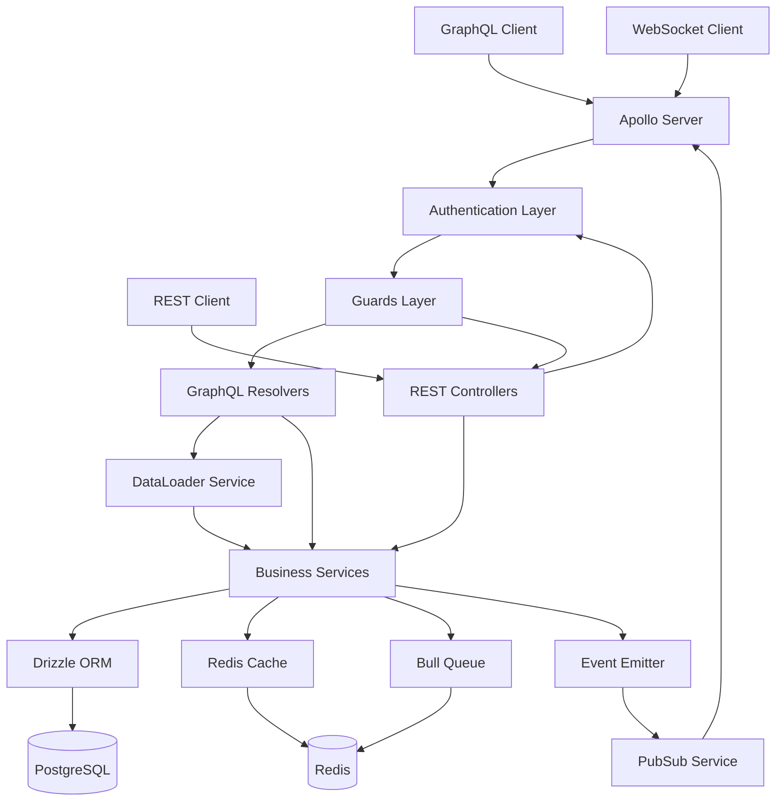

# Design Document: GraphQL Migration

## Overview

This design document outlines the architecture and implementation approach for migrating the unified business management platform from 88.1% REST API coverage to 100% GraphQL API coverage. The migration will create 77 new GraphQL resolvers across 24 business modules while maintaining complete backward compatibility with all 89 existing REST controllers.

The design follows a code-first approach using NestJS and Apollo Server, leveraging existing infrastructure including DataLoader support, multi-tenant architecture, event-driven patterns, and Redis caching. The migration is structured in 7 phases to minimize risk and enable incremental delivery.

### Key Design Principles

1. **Backward Compatibility**: All existing REST endpoints remain functional
2. **Zero Service Changes**: Business logic in the 158 service files remains unchanged unless optimization is required
3. **Security First**: All resolvers enforce authentication, authorization, and tenant isolation
4. **Performance Optimized**: DataLoader prevents N+1 queries, Redis caching reduces load
5. **Real-Time Capable**: Subscriptions enable live data updates via WebSocket
6. **Developer Friendly**: Code-first approach keeps TypeScript and GraphQL schema synchronized
7. **Testable**: Comprehensive unit and integration tests ensure reliability

## Architecture

### High-Level Architecture



### Request Flow

**GraphQL Query Flow:**
1. Client sends GraphQL query to Apollo Server
2. Apollo Server extracts JWT token and creates context
3. JwtAuthGuard validates token and loads user
4. TenantGuard extracts tenant ID and validates access
5. FeatureGuard checks feature flags (if applicable)
6. PermissionsGuard validates user permissions (if applicable)
7. Resolver method executes with authenticated context
8. Resolver calls service methods with tenant filtering
9. Service queries database via Drizzle ORM
10. DataLoader batches and caches entity loads
11. Redis cache serves frequently accessed data
12. Response formatted and returned to client

**GraphQL Mutation Flow:**
1. Steps 1-7 same as query flow
2. Resolver validates input using class-validator
3. Service performs business logic and database updates
4. Service emits domain events via EventEmitter
5. Cache invalidation triggered for affected data
6. Background jobs enqueued if needed
7. PubSub publishes subscription events
8. Mutation response returned to client

**GraphQL Subscription Flow:**
1. Client establishes WebSocket connection
2. Apollo Server authenticates WebSocket connection
3. Client sends subscription operation
4. Subscription resolver registers listener with PubSub
5. When events occur, PubSub filters by tenant
6. Filtered events pushed to subscribed clients
7. Client receives real-time updates

### Multi-Tenant Architecture

All GraphQL operations enforce tenant isolation through multiple layers:

1. **Authentication Layer**: JWT token contains tenant ID
2. **Guard Layer**: TenantGuard validates tenant access
3. **Context Layer**: Tenant ID available in resolver context
4. **Service Layer**: All queries filtered by tenant ID
5. **DataLoader Layer**: Loaders scoped by tenant
6. **Database Layer**: Drizzle ORM applies tenant filters
7. **Subscription Layer**: Events filtered by tenant

### DataLoader Architecture

DataLoader prevents N+1 query problems by batching and caching entity loads:

```typescript
// Request-scoped DataLoader service
@Injectable({ scope: Scope.REQUEST })
export class DataLoaderService {
  private loaders = new Map<string, DataLoader<any, any>>();
  
  getLoader<K, V>(
    key: string,
    batchLoadFn: DataLoader.BatchLoadFn<K, V>,
    options?: DataLoader.Options<K, V>
  ): DataLoader<K, V>;
}

// Usage in resolver
@ResolveField(() => Product)
async product(@Parent() inventory: Inventory): Promise<Product> {
  const loader = this.dataLoaderService.getLoader(
    'product_by_id',
    this.productService.batchLoadByIds.bind(this.productService)
  );
  return loader.load(inventory.productId);
}
```

## Components and Interfaces

### Base Resolver Template

All resolvers extend BaseResolver for common functionality:

```typescript
import { UseGuards, UseInterceptors } from '@nestjs/common';
import { Resolver, Query, Mutation, Args, Context, Info } from '@nestjs/graphql';
import { GraphQLResolveInfo } from 'graphql';
import { JwtAuthGuard } from '../../auth/guards/jwt-auth.guard';
import { TenantGuard } from '../../tenant/guards/tenant.guard';
import { FeatureGuard } from '../../tenant/guards/feature.guard';
import { PermissionsGuard } from '../../auth/guards/permissions.guard';
import { TenantInterceptor } from '../../tenant/interceptors/tenant.interceptor';
import { CurrentUser } from '../../auth/decorators/auth.decorators';
import { CurrentTenant } from '../../tenant/decorators/tenant.decorators';
import { Permissions } from '../../auth/decorators/permissions.decorator';
import { Feature } from '../../tenant/decorators/feature.decorator';
import { DataLoaderService } from '../../../common/graphql/dataloader.service';
import { BaseResolver } from '../../../common/graphql/base.resolver';

@Resolver(() => EntityType)
@UseGuards(JwtAuthGuard, TenantGuard)
@UseInterceptors(TenantInterceptor)
export class EntityResolver extends BaseResolver {
  constructor(
    protected readonly dataLoaderService: DataLoaderService,
    private readonly entityService: EntityService,
  ) {
    super(dataLoaderService);
  }

  @Query(() => EntityType)
  @UseGuards(PermissionsGuard)
  @Permissions('entity:read')
  async entity(
    @Args('id', { type: () => ID }) id: string,
    @CurrentUser() user: AuthenticatedUser,
    @CurrentTenant() tenantId: string,
    @Info() info: GraphQLResolveInfo,
  ): Promise<EntityType> {
    return this.entityService.findById(id, tenantId);
  }

  @Query(() => EntityConnection)
  @UseGuards(PermissionsGuard)
  @Permissions('entity:read')
  async entities(
    @Args() args: PaginationArgs,
    @CurrentUser() user: AuthenticatedUser,
    @CurrentTenant() tenantId: string,
  ): Promise<EntityConnection> {
    const { limit, cursor, isForward } = this.parsePaginationArgs(args);
    const result = await this.entityService.findAll(tenantId, { limit, cursor, isForward });
    
    return {
      edges: this.createEdges(result.items, item => item.id),
      pageInfo: this.createPageInfo(
        result.hasNextPage,
        result.hasPreviousPage,
        result.items[0]?.id,
        result.items[result.items.length - 1]?.id,
      ),
      totalCount: result.totalCount,
    };
  }

  @Mutation(() => EntityType)
  @UseGuards(PermissionsGuard)
  @Permissions('entity:create')
  async createEntity(
    @Args('input') input: CreateEntityInput,
    @CurrentUser() user: AuthenticatedUser,
    @CurrentTenant() tenantId: string,
  ): Promise<EntityType> {
    return this.entityService.create(input, tenantId, user.id);
  }

  @Mutation(() => EntityType)
  @UseGuards(PermissionsGuard)
  @Permissions('entity:update')
  async updateEntity(
    @Args('id', { type: () => ID }) id: string,
    @Args('input') input: UpdateEntityInput,
    @CurrentUser() user: AuthenticatedUser,
    @CurrentTenant() tenantId: string,
  ): Promise<EntityType> {
    return this.entityService.update(id, input, tenantId, user.id);
  }

  @Mutation(() => Boolean)
  @UseGuards(PermissionsGuard)
  @Permissions('entity:delete')
  async deleteEntity(
    @Args('id', { type: () => ID }) id: string,
    @CurrentUser() user: AuthenticatedUser,
    @CurrentTenant() tenantId: string,
  ): Promise<boolean> {
    await this.entityService.delete(id, tenantId, user.id);
    return true;
  }

  @ResolveField(() => RelatedType)
  async relatedEntity(
    @Parent() entity: EntityType,
    @CurrentTenant() tenantId: string,
  ): Promise<RelatedType> {
    const loader = this.dataLoaderService.getLoader(
      'related_by_id',
      this.relatedService.batchLoadByIds.bind(this.relatedService),
    );
    return loader.load(entity.relatedId);
  }
}
```

### Entity Type Template

All entity types extend BaseEntity and use decorators for both GraphQL and REST:

```typescript
import { ObjectType, Field, ID, Int, Float } from '@nestjs/graphql';
import { ApiProperty } from '@nestjs/swagger';
import { BaseEntity } from '../../../common/graphql/base.types';

@ObjectType()
export class EntityType extends BaseEntity {
  @Field(() => ID)
  @ApiProperty({ description: 'Unique identifier' })
  id!: string;

  @Field()
  @ApiProperty({ description: 'Entity name' })
  name!: string;

  @Field({ nullable: true })
  @ApiProperty({ description: 'Entity description', required: false })
  description?: string;

  @Field(() => Int)
  @ApiProperty({ description: 'Numeric value' })
  count!: number;

  @Field(() => Float)
  @ApiProperty({ description: 'Decimal value' })
  amount!: number;

  @Field()
  @ApiProperty({ description: 'Status' })
  status!: string;

  @Field(() => [String])
  @ApiProperty({ description: 'Tags', type: [String] })
  tags!: string[];

  // Relationships loaded via field resolvers
  @Field(() => RelatedType, { nullable: true })
  @ApiProperty({ type: () => RelatedType, required: false })
  related?: RelatedType;

  @Field(() => [ChildType])
  @ApiProperty({ type: [ChildType] })
  children?: ChildType[];
}
```

### Input Type Template

Input types use @InputType decorator and validation decorators:

```typescript
import { InputType, Field, Int, Float } from '@nestjs/graphql';
import { ApiProperty } from '@nestjs/swagger';
import { IsString, IsOptional, IsInt, IsNumber, IsArray, MinLength, MaxLength, Min, Max } from 'class-validator';

@InputType()
export class CreateEntityInput {
  @Field()
  @ApiProperty({ description: 'Entity name' })
  @IsString()
  @MinLength(1)
  @MaxLength(255)
  name!: string;

  @Field({ nullable: true })
  @ApiProperty({ description: 'Entity description', required: false })
  @IsOptional()
  @IsString()
  @MaxLength(1000)
  description?: string;

  @Field(() => Int)
  @ApiProperty({ description: 'Numeric value' })
  @IsInt()
  @Min(0)
  count!: number;

  @Field(() => Float)
  @ApiProperty({ description: 'Decimal value' })
  @IsNumber()
  @Min(0)
  amount!: number;

  @Field()
  @ApiProperty({ description: 'Status' })
  @IsString()
  status!: string;

  @Field(() => [String], { nullable: true })
  @ApiProperty({ description: 'Tags', type: [String], required: false })
  @IsOptional()
  @IsArray()
  @IsString({ each: true })
  tags?: string[];
}

@InputType()
export class UpdateEntityInput {
  @Field({ nullable: true })
  @ApiProperty({ description: 'Entity name', required: false })
  @IsOptional()
  @IsString()
  @MinLength(1)
  @MaxLength(255)
  name?: string;

  @Field({ nullable: true })
  @ApiProperty({ description: 'Entity description', required: false })
  @IsOptional()
  @IsString()
  @MaxLength(1000)
  description?: string;

  @Field(() => Int, { nullable: true })
  @ApiProperty({ description: 'Numeric value', required: false })
  @IsOptional()
  @IsInt()
  @Min(0)
  count?: number;

  @Field(() => Float, { nullable: true })
  @ApiProperty({ description: 'Decimal value', required: false })
  @IsOptional()
  @IsNumber()
  @Min(0)
  amount?: number;

  @Field({ nullable: true })
  @ApiProperty({ description: 'Status', required: false })
  @IsOptional()
  @IsString()
  status?: string;

  @Field(() => [String], { nullable: true })
  @ApiProperty({ description: 'Tags', type: [String], required: false })
  @IsOptional()
  @IsArray()
  @IsString({ each: true })
  tags?: string[];
}
```

### Connection Type Template

Connection types implement cursor-based pagination:

```typescript
import { ObjectType, Field } from '@nestjs/graphql';
import { ApiProperty } from '@nestjs/swagger';
import { Connection, Edge, PageInfo } from '../../../common/graphql/base.types';

@ObjectType()
export class EntityEdge extends Edge<EntityType> {
  @Field(() => EntityType)
  @ApiProperty({ type: EntityType })
  node!: EntityType;
}

@ObjectType()
export class EntityConnection extends Connection<EntityType> {
  @Field(() => [EntityEdge])
  @ApiProperty({ type: [EntityEdge] })
  edges!: EntityEdge[];
}
```

### Subscription Template

Subscriptions use PubSub for real-time events:

```typescript
import { Resolver, Subscription, Args } from '@nestjs/graphql';
import { Inject } from '@nestjs/common';
import { PubSub } from 'graphql-subscriptions';
import { CurrentTenant } from '../../tenant/decorators/tenant.decorators';

@Resolver()
export class EntitySubscriptionResolver {
  constructor(
    @Inject('PUB_SUB') private readonly pubSub: PubSub,
  ) {}

  @Subscription(() => EntityType, {
    filter: (payload, variables, context) => {
      // Filter by tenant
      return payload.entityCreated.tenantId === context.req.user.tenantId;
    },
  })
  entityCreated(@CurrentTenant() tenantId: string) {
    return this.pubSub.asyncIterator('ENTITY_CREATED');
  }

  @Subscription(() => EntityType, {
    filter: (payload, variables, context) => {
      return (
        payload.entityUpdated.tenantId === context.req.user.tenantId &&
        payload.entityUpdated.id === variables.id
      );
    },
  })
  entityUpdated(
    @Args('id', { type: () => ID }) id: string,
    @CurrentTenant() tenantId: string,
  ) {
    return this.pubSub.asyncIterator('ENTITY_UPDATED');
  }
}
```

### Service Optimization Pattern

Services add batch loading methods for DataLoader:

```typescript
export class EntityService {
  // Existing methods remain unchanged
  async findById(id: string, tenantId: string): Promise<Entity> {
    // Existing implementation
  }

  async findAll(tenantId: string, options: QueryOptions): Promise<QueryResult<Entity>> {
    // Existing implementation
  }

  // New batch loading method for DataLoader
  async batchLoadByIds(ids: readonly string[]): Promise<(Entity | Error)[]> {
    const entities = await this.db
      .select()
      .from(entityTable)
      .where(inArray(entityTable.id, [...ids]));

    const entityMap = new Map<string, Entity>();
    entities.forEach(entity => entityMap.set(entity.id, entity));

    return ids.map(id => entityMap.get(id) || new Error(`Entity not found: ${id}`));
  }

  // Tenant-scoped batch loading
  async batchLoadByIdsAndTenant(
    keys: readonly { id: string; tenantId: string }[]
  ): Promise<(Entity | Error)[]> {
    const ids = keys.map(k => k.id);
    const tenantId = keys[0].tenantId; // All keys should have same tenant

    const entities = await this.db
      .select()
      .from(entityTable)
      .where(
        and(
          inArray(entityTable.id, [...ids]),
          eq(entityTable.tenantId, tenantId)
        )
      );

    const entityMap = new Map<string, Entity>();
    entities.forEach(entity => entityMap.set(entity.id, entity));

    return keys.map(key => 
      entityMap.get(key.id) || new Error(`Entity not found: ${key.id}`)
    );
  }

  // Batch loading for relationships
  async batchLoadByForeignKey(
    foreignKeys: readonly string[]
  ): Promise<Entity[][]> {
    const entities = await this.db
      .select()
      .from(entityTable)
      .where(inArray(entityTable.foreignKey, [...foreignKeys]));

    const entityMap = new Map<string, Entity[]>();
    entities.forEach(entity => {
      if (!entityMap.has(entity.foreignKey)) {
        entityMap.set(entity.foreignKey, []);
      }
      entityMap.get(entity.foreignKey)!.push(entity);
    });

    return foreignKeys.map(key => entityMap.get(key) || []);
  }
}
```

## Data Models

### GraphQL Schema Structure

The GraphQL schema is organized by module with clear separation:

```graphql
# Core types
type Query
type Mutation
type Subscription

# Pagination types
type PageInfo
interface Connection
interface Edge

# Entity types (one per module)
type Product
type Inventory
type Customer
type Employee
type Transaction
# ... etc

# Input types
input CreateProductInput
input UpdateProductInput
input ProductFilterInput
# ... etc

# Connection types
type ProductConnection
type ProductEdge
# ... etc

# Enum types
enum ProductStatus
enum OrderStatus
# ... etc

# Scalar types
scalar DateTime
scalar JSON
scalar Upload
```

### Common Patterns

**Filtering Pattern:**
```typescript
@InputType()
export class EntityFilterInput {
  @Field({ nullable: true })
  @IsOptional()
  @IsString()
  search?: string;

  @Field(() => [String], { nullable: true })
  @IsOptional()
  @IsArray()
  status?: string[];

  @Field({ nullable: true })
  @IsOptional()
  startDate?: Date;

  @Field({ nullable: true })
  @IsOptional()
  endDate?: Date;

  @Field(() => [String], { nullable: true })
  @IsOptional()
  tags?: string[];
}
```

**Sorting Pattern:**
```typescript
@InputType()
export class EntitySortInput {
  @Field()
  @IsString()
  field!: string;

  @Field(() => SortOrder)
  order!: SortOrder;
}

@registerEnumType(SortOrder, { name: 'SortOrder' })
export enum SortOrder {
  ASC = 'ASC',
  DESC = 'DESC',
}
```

**Mutation Response Pattern:**
```typescript
@ObjectType()
export class EntityMutationResponse extends MutationResponse {
  @Field(() => EntityType, { nullable: true })
  @ApiProperty({ type: EntityType, required: false })
  entity?: EntityType;
}
```


## Correctness Properties

A property is a characteristic or behavior that should hold true across all valid executions of a system—essentially, a formal statement about what the system should do. Properties serve as the bridge between human-readable specifications and machine-verifiable correctness guarantees.

### Property Reflection

After analyzing all acceptance criteria, I identified 25 testable properties. Upon reflection, I found the following opportunities for consolidation:

**Consolidation Analysis:**
- Properties about tenant isolation (2.3, 2.4, 2.5) can be combined into comprehensive tenant isolation properties
- Properties about error handling (3.6, 7.2, 7.3, 7.4) can be consolidated into error response properties
- Properties about pagination (6.3, 6.4, 6.5, 6.6) are distinct and should remain separate
- Properties about subscriptions (5.2, 5.4, 5.5) are distinct aspects and should remain separate
- Properties about caching and jobs (11.2, 12.1, 12.2, 12.5) are distinct and should remain separate

After consolidation, we have 20 distinct correctness properties.

### Core Properties

**Property 1: REST-GraphQL Functional Equivalence**

*For any* REST endpoint and its equivalent GraphQL operation, when called with the same input data and authentication context, both should return functionally equivalent results (same data, same business logic applied, same side effects).

**Validates: Requirements 1.2**

**Property 2: Tenant Data Isolation**

*For any* GraphQL query or mutation, when executed by a user with tenant ID T, the results should only include data where tenantId equals T, and no data from other tenants should be accessible.

**Validates: Requirements 2.1, 2.3**

**Property 3: Cross-Tenant Access Rejection**

*For any* GraphQL operation that attempts to access data with a tenant ID different from the authenticated user's tenant ID, the system should reject the operation with a FORBIDDEN error unless the user has explicit cross-tenant permissions.

**Validates: Requirements 2.4**

**Property 4: DataLoader Tenant Scoping**

*For any* DataLoader instance loading entities within a request, when entities from multiple tenants exist in the database, the loader should only return entities matching the request's tenant context.

**Validates: Requirements 2.5**

**Property 5: Authentication Error Codes**

*For any* GraphQL operation that fails authentication or authorization, the system should return a GraphQL error with code UNAUTHENTICATED (for missing/invalid auth) or FORBIDDEN (for insufficient permissions).

**Validates: Requirements 3.6**

**Property 6: DataLoader Request Deduplication**

*For any* entity ID requested multiple times within a single GraphQL request, the system should execute only one database query for that ID, with subsequent requests served from DataLoader cache.

**Validates: Requirements 4.4**

**Property 7: Batch Load Error Handling**

*For any* batch load operation requesting multiple entity IDs, when some IDs don't exist, the system should return null or Error objects in the corresponding array positions without failing the entire batch.

**Validates: Requirements 4.6**

**Property 8: Domain Event to Subscription Propagation**

*For any* domain event emitted via EventEmitter, when subscriptions are listening for that event type, the system should publish a corresponding subscription event via PubSub.

**Validates: Requirements 5.2**

**Property 9: Subscription Authentication**

*For any* WebSocket subscription attempt, when no valid JWT token is provided, the system should reject the connection with an authentication error.

**Validates: Requirements 5.4**

**Property 10: Subscription Tenant Filtering**

*For any* subscription event published, when multiple tenants have active subscriptions, each tenant should only receive events where the event's tenantId matches their tenant context.

**Validates: Requirements 5.5**

**Property 11: Pagination Response Structure**

*For any* paginated GraphQL query, the response should conform to the Relay connection specification with edges (containing cursor and node), pageInfo (containing hasNextPage, hasPreviousPage, startCursor, endCursor), and totalCount fields.

**Validates: Requirements 6.3**

**Property 12: Pagination Size Limit**

*For any* paginated query requesting more than 100 items (via first or last arguments), the system should limit the result set to 100 items maximum.

**Validates: Requirements 6.4**

**Property 13: Pagination Argument Validation**

*For any* paginated query with invalid arguments (e.g., both first and last specified, negative values, both after and before specified), the system should return a validation error.

**Validates: Requirements 6.5**

**Property 14: Cursor Opacity**

*For any* cursor returned in pagination responses, the cursor should be an opaque string that, when modified by clients, either fails validation or produces an error rather than allowing cursor manipulation.

**Validates: Requirements 6.6**

**Property 15: Validation Error Format**

*For any* GraphQL operation with invalid input that fails validation, the system should return a GraphQL error with code VALIDATION_ERROR and include detailed validation messages describing which fields failed and why.

**Validates: Requirements 7.2**

**Property 16: Service Error Conversion**

*For any* service layer error (database errors, business logic errors, etc.), the system should convert it to an appropriate GraphQL error with a meaningful error code and message.

**Validates: Requirements 7.3**

**Property 17: Error Response Completeness**

*For any* GraphQL error response, the error object should include an error code, a message, and a timestamp.

**Validates: Requirements 7.4**

**Property 18: Field Resolver Lazy Execution**

*For any* GraphQL query, field resolvers should only execute when their corresponding fields are explicitly requested in the query selection set, not for fields that aren't requested.

**Validates: Requirements 8.4**

**Property 19: Service Event Emission Preservation**

*For any* service operation that emits domain events in the REST API flow, when called from a GraphQL resolver, the same domain events should be emitted.

**Validates: Requirements 9.5**

**Property 20: Mutation Cache Invalidation**

*For any* GraphQL mutation that modifies entity data, when the mutation completes successfully, all cache entries related to the modified entity should be invalidated.

**Validates: Requirements 11.2**

**Property 21: Async Operation Job Enqueueing**

*For any* GraphQL mutation that triggers a long-running operation (operations expected to take >5 seconds), the system should enqueue a Bull queue job and return immediately rather than blocking.

**Validates: Requirements 12.1**

**Property 22: Async Operation Job ID Response**

*For any* GraphQL mutation that enqueues a background job, the mutation response should include a job ID or tracking identifier that clients can use to check status.

**Validates: Requirements 12.2**

**Property 23: Job Completion Event Emission**

*For any* background job that completes (successfully or with failure), the system should emit a domain event indicating job completion with the job ID and status.

**Validates: Requirements 12.5**

**Property 24: Query Depth Limiting**

*For any* GraphQL query with nesting depth exceeding the configured maximum (e.g., 10 levels), the system should reject the query with a complexity error before execution.

**Validates: Requirements 29.2**


## Error Handling

### Error Classification

All errors are classified into categories with specific error codes:

```typescript
export enum GraphQLErrorCode {
  // Authentication errors
  UNAUTHENTICATED = 'UNAUTHENTICATED',
  INVALID_TOKEN = 'INVALID_TOKEN',
  TOKEN_EXPIRED = 'TOKEN_EXPIRED',
  
  // Authorization errors
  FORBIDDEN = 'FORBIDDEN',
  INSUFFICIENT_PERMISSIONS = 'INSUFFICIENT_PERMISSIONS',
  FEATURE_DISABLED = 'FEATURE_DISABLED',
  
  // Validation errors
  VALIDATION_ERROR = 'VALIDATION_ERROR',
  INVALID_INPUT = 'INVALID_INPUT',
  INVALID_CURSOR = 'INVALID_CURSOR',
  
  // Resource errors
  NOT_FOUND = 'NOT_FOUND',
  ALREADY_EXISTS = 'ALREADY_EXISTS',
  CONFLICT = 'CONFLICT',
  
  // Tenant errors
  TENANT_NOT_FOUND = 'TENANT_NOT_FOUND',
  CROSS_TENANT_ACCESS = 'CROSS_TENANT_ACCESS',
  
  // Business logic errors
  BUSINESS_RULE_VIOLATION = 'BUSINESS_RULE_VIOLATION',
  INVALID_STATE = 'INVALID_STATE',
  
  // System errors
  INTERNAL_SERVER_ERROR = 'INTERNAL_SERVER_ERROR',
  DATABASE_ERROR = 'DATABASE_ERROR',
  CACHE_ERROR = 'CACHE_ERROR',
  QUEUE_ERROR = 'QUEUE_ERROR',
  
  // Rate limiting
  RATE_LIMIT_EXCEEDED = 'RATE_LIMIT_EXCEEDED',
  QUERY_TOO_COMPLEX = 'QUERY_TOO_COMPLEX',
  QUERY_TOO_DEEP = 'QUERY_TOO_DEEP',
}
```

### Error Handling Pattern

```typescript
import { GraphQLError } from 'graphql';

export class GraphQLErrorHandler {
  static handleError(error: any, context?: string): GraphQLError {
    // Log error for debugging
    console.error(`GraphQL Error in ${context}:`, error);

    // Handle known error types
    if (error instanceof ValidationError) {
      return new GraphQLError(error.message, {
        extensions: {
          code: GraphQLErrorCode.VALIDATION_ERROR,
          validationErrors: error.errors,
          timestamp: new Date().toISOString(),
        },
      });
    }

    if (error instanceof UnauthorizedError) {
      return new GraphQLError('Authentication required', {
        extensions: {
          code: GraphQLErrorCode.UNAUTHENTICATED,
          timestamp: new Date().toISOString(),
        },
      });
    }

    if (error instanceof ForbiddenError) {
      return new GraphQLError('Insufficient permissions', {
        extensions: {
          code: GraphQLErrorCode.FORBIDDEN,
          timestamp: new Date().toISOString(),
        },
      });
    }

    if (error instanceof NotFoundError) {
      return new GraphQLError(error.message, {
        extensions: {
          code: GraphQLErrorCode.NOT_FOUND,
          resource: error.resource,
          timestamp: new Date().toISOString(),
        },
      });
    }

    if (error instanceof TenantIsolationError) {
      return new GraphQLError('Access denied: Cross-tenant access not allowed', {
        extensions: {
          code: GraphQLErrorCode.CROSS_TENANT_ACCESS,
          timestamp: new Date().toISOString(),
        },
      });
    }

    // Default to internal server error
    return new GraphQLError('An unexpected error occurred', {
      extensions: {
        code: GraphQLErrorCode.INTERNAL_SERVER_ERROR,
        timestamp: new Date().toISOString(),
      },
    });
  }
}
```

### Error Response Format

All GraphQL errors follow this structure:

```json
{
  "errors": [
    {
      "message": "Validation failed",
      "extensions": {
        "code": "VALIDATION_ERROR",
        "validationErrors": [
          {
            "field": "name",
            "message": "Name must be at least 1 character",
            "constraint": "minLength"
          }
        ],
        "timestamp": "2024-01-15T10:30:00.000Z"
      },
      "locations": [
        {
          "line": 2,
          "column": 3
        }
      ],
      "path": ["createProduct"]
    }
  ],
  "data": null
}
```

## Module-by-Module Implementation

Detailed implementation guidance for all 77 resolvers across 24 business modules is provided in the companion document `module-implementation-guide.md`. This includes:

- Specific operations for each resolver
- DataLoader requirements
- Field resolver patterns
- Subscription implementations
- Caching strategies
- Background job integration
- Security considerations
- Performance optimizations

Each module section provides:
- Resolver purpose and responsibilities
- Key GraphQL operations (queries, mutations, subscriptions)
- Field resolver requirements for relationships
- DataLoader batch loading patterns
- Caching and performance considerations
- Security and permission requirements
- Integration with existing services

## Testing Strategy

### Dual Testing Approach

The migration requires both unit tests and property-based tests:

**Unit Tests:**
- Test specific examples and edge cases
- Test integration points between components
- Test error conditions with specific inputs
- Test authentication/authorization scenarios
- Test subscription delivery
- Focus on concrete, deterministic scenarios

**Property-Based Tests:**
- Test universal properties across randomized inputs
- Test tenant isolation with random tenant IDs
- Test pagination with random page sizes and cursors
- Test DataLoader with random entity sets
- Test error handling with random invalid inputs
- Run minimum 100 iterations per property test

### Unit Testing Patterns

**Resolver Unit Test Template:**

```typescript
import { Test, TestingModule } from '@nestjs/testing';
import { EntityResolver } from './entity.resolver';
import { EntityService } from '../services/entity.service';
import { DataLoaderService } from '../../../common/graphql/dataloader.service';

describe('EntityResolver', () => {
  let resolver: EntityResolver;
  let service: EntityService;
  let dataLoaderService: DataLoaderService;

  const mockUser = {
    id: 'user-1',
    tenantId: 'tenant-1',
    permissions: ['entity:read', 'entity:create', 'entity:update', 'entity:delete'],
  };

  const mockEntity = {
    id: 'entity-1',
    tenantId: 'tenant-1',
    name: 'Test Entity',
    createdAt: new Date(),
    updatedAt: new Date(),
  };

  beforeEach(async () => {
    const module: TestingModule = await Test.createTestingModule({
      providers: [
        EntityResolver,
        {
          provide: EntityService,
          useValue: {
            findById: jest.fn(),
            findAll: jest.fn(),
            create: jest.fn(),
            update: jest.fn(),
            delete: jest.fn(),
          },
        },
        {
          provide: DataLoaderService,
          useValue: {
            getLoader: jest.fn(),
          },
        },
      ],
    }).compile();

    resolver = module.get<EntityResolver>(EntityResolver);
    service = module.get<EntityService>(EntityService);
    dataLoaderService = module.get<DataLoaderService>(DataLoaderService);
  });

  describe('entity query', () => {
    it('should return entity by id', async () => {
      jest.spyOn(service, 'findById').mockResolvedValue(mockEntity);

      const result = await resolver.entity('entity-1', mockUser, 'tenant-1', {} as any);

      expect(result).toEqual(mockEntity);
      expect(service.findById).toHaveBeenCalledWith('entity-1', 'tenant-1');
    });

    it('should throw error when entity not found', async () => {
      jest.spyOn(service, 'findById').mockResolvedValue(null);

      await expect(
        resolver.entity('nonexistent', mockUser, 'tenant-1', {} as any)
      ).rejects.toThrow();
    });

    it('should enforce tenant isolation', async () => {
      jest.spyOn(service, 'findById').mockResolvedValue(mockEntity);

      await resolver.entity('entity-1', mockUser, 'tenant-1', {} as any);

      expect(service.findById).toHaveBeenCalledWith('entity-1', 'tenant-1');
    });
  });

  describe('createEntity mutation', () => {
    const createInput = {
      name: 'New Entity',
      description: 'Test description',
    };

    it('should create entity successfully', async () => {
      jest.spyOn(service, 'create').mockResolvedValue(mockEntity);

      const result = await resolver.createEntity(createInput, mockUser, 'tenant-1');

      expect(result).toEqual(mockEntity);
      expect(service.create).toHaveBeenCalledWith(createInput, 'tenant-1', 'user-1');
    });

    it('should validate input', async () => {
      const invalidInput = { name: '' }; // Invalid: empty name

      await expect(
        resolver.createEntity(invalidInput as any, mockUser, 'tenant-1')
      ).rejects.toThrow();
    });
  });
});
```

**Integration Test Template:**

```typescript
import { Test, TestingModule } from '@nestjs/testing';
import { INestApplication } from '@nestjs/common';
import * as request from 'supertest';
import { AppModule } from '../../../app.module';

describe('Entity GraphQL Integration', () => {
  let app: INestApplication;
  let authToken: string;

  beforeAll(async () => {
    const moduleFixture: TestingModule = await Test.createTestingModule({
      imports: [AppModule],
    }).compile();

    app = moduleFixture.createNestApplication();
    await app.init();

    // Authenticate and get token
    const loginResponse = await request(app.getHttpServer())
      .post('/graphql')
      .send({
        query: `
          mutation {
            login(email: "test@example.com", password: "password") {
              token
            }
          }
        `,
      });

    authToken = loginResponse.body.data.login.token;
  });

  afterAll(async () => {
    await app.close();
  });

  describe('Entity CRUD workflow', () => {
    let entityId: string;

    it('should create entity', async () => {
      const response = await request(app.getHttpServer())
        .post('/graphql')
        .set('Authorization', `Bearer ${authToken}`)
        .send({
          query: `
            mutation CreateEntity($input: CreateEntityInput!) {
              createEntity(input: $input) {
                id
                name
                description
              }
            }
          `,
          variables: {
            input: {
              name: 'Integration Test Entity',
              description: 'Created in integration test',
            },
          },
        });

      expect(response.status).toBe(200);
      expect(response.body.data.createEntity).toHaveProperty('id');
      expect(response.body.data.createEntity.name).toBe('Integration Test Entity');

      entityId = response.body.data.createEntity.id;
    });

    it('should query entity', async () => {
      const response = await request(app.getHttpServer())
        .post('/graphql')
        .set('Authorization', `Bearer ${authToken}`)
        .send({
          query: `
            query GetEntity($id: ID!) {
              entity(id: $id) {
                id
                name
                description
              }
            }
          `,
          variables: { id: entityId },
        });

      expect(response.status).toBe(200);
      expect(response.body.data.entity.id).toBe(entityId);
    });

    it('should update entity', async () => {
      const response = await request(app.getHttpServer())
        .post('/graphql')
        .set('Authorization', `Bearer ${authToken}`)
        .send({
          query: `
            mutation UpdateEntity($id: ID!, $input: UpdateEntityInput!) {
              updateEntity(id: $id, input: $input) {
                id
                name
                description
              }
            }
          `,
          variables: {
            id: entityId,
            input: {
              name: 'Updated Entity Name',
            },
          },
        });

      expect(response.status).toBe(200);
      expect(response.body.data.updateEntity.name).toBe('Updated Entity Name');
    });

    it('should delete entity', async () => {
      const response = await request(app.getHttpServer())
        .post('/graphql')
        .set('Authorization', `Bearer ${authToken}`)
        .send({
          query: `
            mutation DeleteEntity($id: ID!) {
              deleteEntity(id: $id)
            }
          `,
          variables: { id: entityId },
        });

      expect(response.status).toBe(200);
      expect(response.body.data.deleteEntity).toBe(true);
    });
  });

  describe('Tenant isolation', () => {
    it('should not allow access to other tenant data', async () => {
      // Create entity as tenant-1
      const createResponse = await request(app.getHttpServer())
        .post('/graphql')
        .set('Authorization', `Bearer ${authToken}`)
        .send({
          query: `
            mutation CreateEntity($input: CreateEntityInput!) {
              createEntity(input: $input) {
                id
              }
            }
          `,
          variables: {
            input: { name: 'Tenant 1 Entity' },
          },
        });

      const entityId = createResponse.body.data.createEntity.id;

      // Try to access as tenant-2
      const tenant2Token = 'token-for-tenant-2'; // Get token for different tenant

      const accessResponse = await request(app.getHttpServer())
        .post('/graphql')
        .set('Authorization', `Bearer ${tenant2Token}`)
        .send({
          query: `
            query GetEntity($id: ID!) {
              entity(id: $id) {
                id
              }
            }
          `,
          variables: { id: entityId },
        });

      expect(accessResponse.body.errors).toBeDefined();
      expect(accessResponse.body.errors[0].extensions.code).toBe('CROSS_TENANT_ACCESS');
    });
  });
});
```

### Property-Based Testing Configuration

All property tests use the following configuration:

```typescript
import { fc } from 'fast-check';

// Minimum 100 iterations per property test
const PROPERTY_TEST_RUNS = 100;

// Custom arbitraries for domain objects
const tenantIdArbitrary = fc.uuid();
const userIdArbitrary = fc.uuid();
const entityIdArbitrary = fc.uuid();

const entityArbitrary = fc.record({
  id: entityIdArbitrary,
  tenantId: tenantIdArbitrary,
  name: fc.string({ minLength: 1, maxLength: 255 }),
  description: fc.option(fc.string({ maxLength: 1000 })),
  count: fc.integer({ min: 0, max: 1000000 }),
  amount: fc.float({ min: 0, max: 1000000 }),
  status: fc.constantFrom('active', 'inactive', 'pending', 'archived'),
  tags: fc.array(fc.string({ minLength: 1, maxLength: 50 }), { maxLength: 10 }),
});

// Property test template
describe('Property: Tenant Data Isolation', () => {
  it('should only return data for current tenant', async () => {
    // Feature: graphql-migration, Property 2: Tenant Data Isolation
    await fc.assert(
      fc.asyncProperty(
        fc.array(entityArbitrary, { minLength: 10, maxLength: 100 }),
        tenantIdArbitrary,
        async (entities, currentTenantId) => {
          // Setup: Insert entities for multiple tenants
          await setupTestData(entities);

          // Execute: Query entities as current tenant
          const result = await queryEntities(currentTenantId);

          // Verify: All results belong to current tenant
          return result.every(entity => entity.tenantId === currentTenantId);
        }
      ),
      { numRuns: PROPERTY_TEST_RUNS }
    );
  });
});
```

### Test Coverage Requirements

- Minimum 80% code coverage for all new resolver code
- 100% coverage of authentication/authorization paths
- 100% coverage of error handling paths
- All 24 correctness properties must have property-based tests
- All critical workflows must have integration tests

### Performance Testing

Performance tests verify:
- Query execution time under load
- DataLoader effectiveness (N+1 prevention)
- Cache hit rates
- Subscription delivery latency
- Database query optimization

```typescript
describe('Performance: DataLoader N+1 Prevention', () => {
  it('should load related entities in single batch', async () => {
    const entities = await createTestEntities(100);
    
    // Track database queries
    const queryCount = trackDatabaseQueries();

    // Execute GraphQL query requesting all entities with related data
    await request(app.getHttpServer())
      .post('/graphql')
      .set('Authorization', `Bearer ${authToken}`)
      .send({
        query: `
          query {
            entities {
              edges {
                node {
                  id
                  name
                  related {
                    id
                    name
                  }
                }
              }
            }
          }
        `,
      });

    // Verify: Should execute 2 queries (entities + batch load related)
    // Not 101 queries (entities + 100 individual related loads)
    expect(queryCount.total).toBeLessThanOrEqual(2);
  });
});
```

